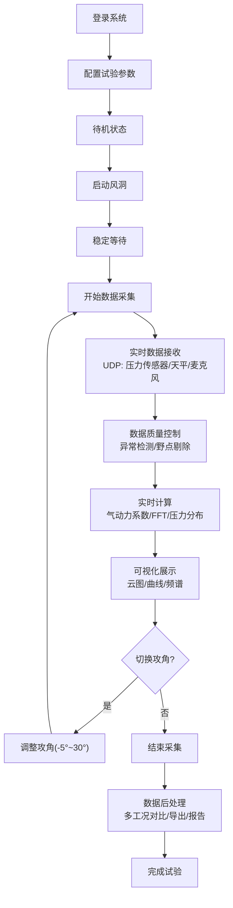

## 1. 产品概述
风洞试验数据实时处理平台是一套专业的航空航天测试系统，用于实时采集、处理、分析和展示风洞试验中的各类传感器数据。
- 主要用途：为飞行器设计提供精确的气动力试验数据支持，包括压力分布、气动力系数、频谱分析等
- 目标用户：航空航天研究机构、高校流体力学实验室、飞行器设计企业
- 产品价值：实现试验数据的实时可视化与分析，提高试验效率和数据质量，降低人工处理成本

## 2. 核心功能

### 2.1 用户角色
| 角色 | 注册方式 | 核心权限 |
|------|----------|----------|
| 试验工程师 | 系统账号 | 配置试验参数、启动/停止采集、查看实时数据、导出报告 |
| 数据分析师 | 系统账号 | 历史数据查询、多工况对比分析、高级后处理 |
| 系统管理员 | 系统账号 | 用户管理、系统配置、设备校准 |

### 2.2 功能模块
1. **实时监控面板**：数据概览、传感器状态、系统状态机
2. **压力分布云图**：翼型截面彩色热力图、时均/脉动压力显示
3. **气动力分析**：升力/阻力/俯仰力矩系数实时曲线
4. **频谱分析**：FFT频谱图、涡脱频率检测
5. **多工况对比**：不同攻角数据叠加对比
6. **视频同步回放**：高速摄像机视频与数据曲线同步
7. **数据后处理**：MAT/CSV导出、PDF试验报告生成

### 2.3 页面详情
| 页面名称 | 模块名称 | 功能描述 |
|---------|----------|----------|
| 实时监控面板 | 系统状态 | 状态机显示（待机→启动→稳定→采集→结束）、设备连接状态 |
| 实时监控面板 | 传感器概览 | 128通道压力传感器、天平六分量力、麦克风阵列数据概览 |
| 实时监控面板 | 异常告警 | 数据质量控制结果、超标预警提示 |
| 压力分布云图 | 翼型截面图 | 2D彩色云图、压力等值线、数值标签 |
| 压力分布云图 | 脉动分析 | 时均压力、脉动均方根、功率谱密度计算显示 |
| 气动力分析 | 系数曲线 | 升力/阻力/俯仰力矩系数实时曲线图 |
| 频谱分析 | FFT分析 | 快速傅里叶变换频谱图、涡脱频率自动检测标注 |
| 多工况对比 | 数据叠加 | 不同攻角（-5°到30°）曲线叠加显示、图例切换 |
| 视频同步 | 时间轴控制 | 拖动时间轴同步回放高速视频（200fps）和数据曲线 |
| 数据后处理 | 数据导出 | 导出MAT文件、CSV格式数据 |
| 数据后处理 | 报告生成 | 自动生成PDF试验报告，包含表格和曲线图 |

## 3. 核心流程
试验工程师登录系统后，配置试验参数（攻角范围、采样率等），启动风洞进入待机状态。启动采集后，系统通过UDP接收传感器数据，进行实时数据质量控制（异常值检测、野点剔除），同时进行实时计算并可视化展示。试验过程中可切换不同攻角进行多工况测试。试验结束后，进行数据后处理，导出数据并生成试验报告。

## 4. 用户界面设计

### 4.1 设计风格
- **主色调**：深空蓝 (#0A1628) 作为主背景色，科技感强，适合专业工程软件
- **辅助色**：青色 (#00D4FF) 用于强调和交互元素，橙色 (#FF6B35) 用于告警提示
- **按钮风格**：扁平化设计，细微边框，hover时有发光效果
- **字体**：主字体使用 Roboto Mono（等宽，便于数据展示），标题使用 Orbitron（科技感字体）
- **布局风格**：网格化多面板布局，支持拖拽调整面板大小
- **图标风格**：线性图标，统一24px尺寸，科技感简洁风格

### 4.2 页面设计概览
| 页面名称 | 模块名称 | UI元素 |
|---------|----------|--------|
| 实时监控面板 | 状态栏 | 顶部状态条显示系统状态、运行时间、数据速率 |
| 实时监控面板 | 传感器网格 | 8x16网格布局显示128通道压力传感器状态 |
| 压力分布云图 | 2D画布 | Canvas绘制翼型截面，彩色热力图映射压力值 |
| 气动力分析 | 曲线图 | ECharts多Y轴图表，支持缩放、数据点悬停 |
| 视频同步 | 时间轴 | 底部时间轴，支持拖动、播放/暂停、倍速控制 |

### 4.3 响应性
- 桌面端优先设计，最低分辨率1920x1080
- 支持2K/4K显示器自适应缩放
- 多面板布局支持拖拽调整和保存布局配置
- 触摸屏设备支持手势缩放图表

### 4.4 动效设计
- 页面加载：面板依次淡入动画，错落有致的入场效果
- 状态切换：状态机节点发光脉冲动画
- 数据更新：数值变化时的平滑过渡动画
- 告警提示：闪烁告警灯 + 边缘呼吸光效
- 视频同步：时间轴指示器平滑移动
