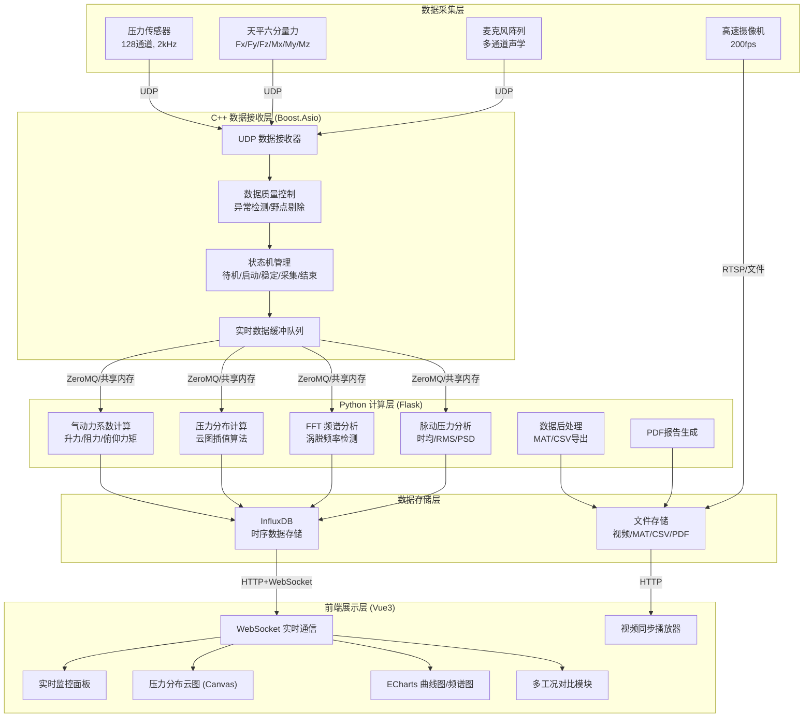
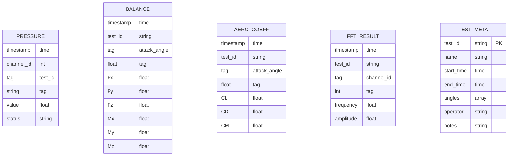
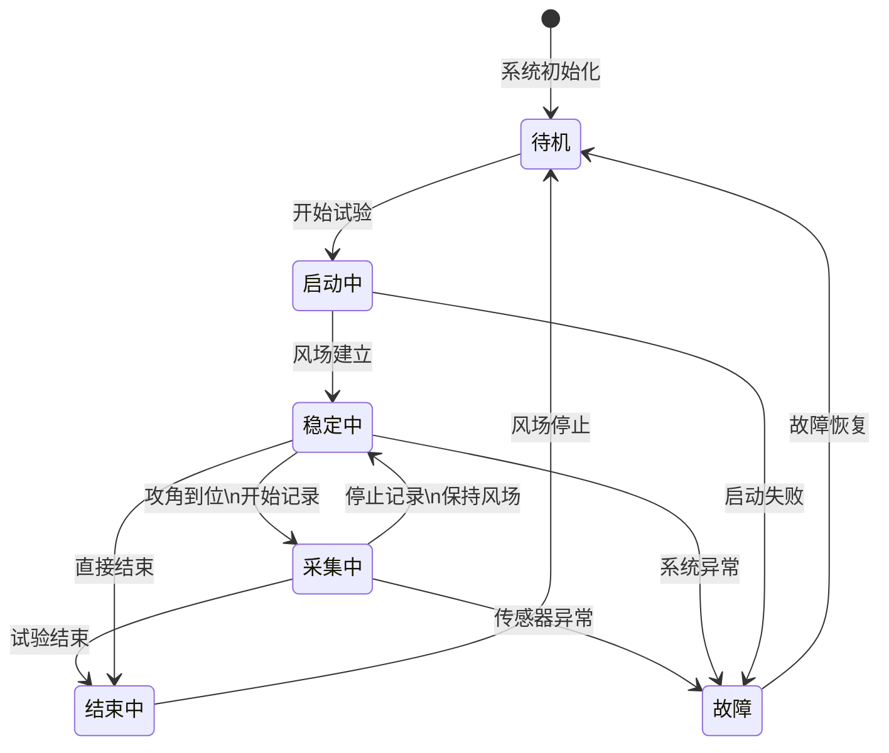

## 1. 架构设计



## 2. 技术描述

### 2.1 前端技术栈
- **框架**: Vue 3.4+ (Composition API)
- **构建工具**: Vite 5.0+
- **UI组件库**: Element Plus (深色主题定制)
- **图表库**: ECharts 5.4+
- **WebSocket**: 原生 WebSocket + reconnecting-websocket
- **状态管理**: Pinia
- **样式**: SCSS + CSS Variables
- **布局**: Golden Layout (多面板拖拽布局)

### 2.2 后端技术栈
- **C++数据接收层**: Boost.Asio 1.82+
  - UDP socket 高并发接收
  - 无锁环形缓冲区设计
  - SIMD 加速数据预处理
- **Python计算层**: Flask 2.3+
  - NumPy/SciPy 科学计算
  - PyFFTW 快速傅里叶变换
  - Matplotlib 报告图表生成
  - ReportLab PDF生成

### 2.3 数据库
- **InfluxDB 2.7+**: 时序数据优化存储
- **数据保留策略**: 原始数据30天，聚合数据1年

## 3. 路由定义

| 路由 | 页面名称 | 功能说明 |
|------|----------|----------|
| / | 实时监控面板 | 系统状态、传感器概览、告警信息 |
| /pressure | 压力分布云图 | 翼型截面压力云图、脉动分析 |
| /aerodynamic | 气动力分析 | 升力/阻力/力矩系数曲线 |
| /spectrum | 频谱分析 | FFT频谱图、涡脱频率检测 |
| /comparison | 多工况对比 | 不同攻角数据叠加对比 |
| /video | 视频同步回放 | 高速视频与数据同步 |
| /export | 数据后处理 | 数据导出、PDF报告生成 |
| /settings | 系统设置 | 传感器校准、参数配置 |

## 4. API 定义

### 4.1 WebSocket 实时数据接口
```typescript
// WebSocket 消息类型
interface WSMessage {
  type: 'pressure' | 'balance' | 'mic' | 'status' | 'alert';
  timestamp: number;
  data: any;
}

// 压力传感器数据
interface PressureData {
  channel: number;      // 1-128
  value: number;        // 压力值 (Pa)
  status: 'normal' | 'warning' | 'error';
}

// 天平六分量力数据
interface BalanceData {
  Fx: number;  // X方向力 (N)
  Fy: number;  // Y方向力 (N)
  Fz: number;  // Z方向力 (N)
  Mx: number;  // X方向力矩 (N·m)
  My: number;  // Y方向力矩 (N·m)
  Mz: number;  // Z方向力矩 (N·m)
}

// 系统状态
interface SystemStatus {
  state: 'idle' | 'starting' | 'stable' | 'acquiring' | 'stopped';
  runTime: number;
  dataRate: number;  // 数据速率 (Hz)
  attackAngle: number;  // 当前攻角 (度)
}
```

### 4.2 HTTP REST 接口
```typescript
// 获取历史数据
GET /api/history?startTime={ts}&endTime={ts}&channels=1,2,3

// 开始采集
POST /api/acquisition/start
{
  "attackAngle": 0,
  "sampleRate": 2000,
  "duration": 300
}

// 停止采集
POST /api/acquisition/stop

// 切换攻角
POST /api/attack-angle
{
  "angle": 5
}

// 导出数据
GET /api/export/mat?testId={id}
GET /api/export/csv?testId={id}&channels=1-128

// 生成报告
POST /api/report/generate
{
  "testId": "string",
  "sections": ["summary", "pressure", "aerodynamic", "spectrum"],
  "format": "pdf"
}
```

## 5. 数据模型

### 5.1 InfluxDB 数据模型



### 5.2 状态机定义



## 6. 关键技术点

### 6.1 高性能数据处理
- **C++ Boost.Asio**: 采用多Reactor模式，支持128通道2kHz采样率（共256k数据点/秒）
- **无锁队列**: 使用 Boost.Lockfree 实现跨线程数据交换
- **SIMD优化**: 使用 AVX2 指令集加速数据质量检查

### 6.2 实时计算算法
- **气动力系数**: Cl = 2F/(ρV²S), Cd = 2D/(ρV²S), Cm = 2M/(ρV²Sc)
- **FFT频谱**: 使用 Welch 方法计算功率谱密度
- **压力云图**: 克里金插值算法生成连续压力分布

### 6.3 数据质量控制
- **3σ准则**: 检测异常值
- **滑动窗口滤波**: 剔除野点
- **传感器相关性校验**: 相邻通道一致性检查

### 6.4 视频同步
- **时间戳对齐**: 使用PTP精确时间协议同步摄像机和数据采集系统
- **缓冲机制**: 预加载30秒视频帧实现平滑回放
- **帧插值**: 支持慢放时的视频帧插值
