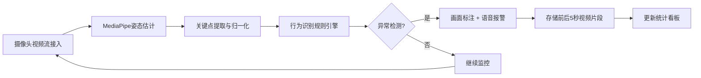

## 1. 产品概述
基于浏览器的自动扶梯异常行为实时检测系统，利用计算机视觉和深度学习技术在边缘端实现智能监控。
- 核心目标：通过纯前端边缘计算实现自动扶梯场景下的异常行为实时检测、报警和统计分析
- 目标用户：商场、地铁、火车站等公共场所的安保运维人员
- 产品价值：提升监控效率、降低人力成本、快速响应异常事件、保护隐私数据

## 2. 核心功能

### 2.1 功能模块
1. **实时监控面板**: 多路视频流接入、姿态估计可视化、异常行为标注
2. **行为识别引擎**: 摔倒检测、逆行检测、大件行李检测、跳跃/奔跑检测
3. **报警系统**: 画面标注、语音警报、视频片段存储
4. **统计看板**: 异常总数统计、类型分布、高峰时段分析
5. **系统设置**: 摄像头配置、检测参数调节、隐私保护开关

### 2.2 页面详情
| 页面名称 | 模块名称 | 功能描述 |
|---------|---------|---------|
| 监控面板 | 多视图视频 | 最多4路视频流网格布局，支持单路全屏 |
| 监控面板 | 姿态可视化 | 实时绘制人体骨架和关键点 |
| 监控面板 | 异常标注 | 异常个体画框标注，显示行为类型和置信度 |
| 统计看板 | 数据概览 | 今日异常总数、各类型统计卡片 |
| 统计看板 | 饼图分析 | 各异常类型占比可视化 |
| 统计看板 | 热力图 | 高峰时段异常发生热力图 |
| 报警记录 | 事件列表 | 历史异常事件查询和回放 |
| 系统设置 | 参数配置 | 检测阈值、报警音量、存储设置 |

## 3. 核心流程

## 4. 用户界面设计

### 4.1 设计风格
- **主色调**: 深蓝科技感 (#0F172A) 搭配警示红 (#EF4444) 和安全绿 (#10B981)
- **辅助色**: 科技蓝 (#3B82F6)、警示黄 (#F59E0B)
- **风格定位**: 工业科技风、专业监控系统风格、深色主题护眼
- **字体**: JetBrains Mono (等宽数字) + Inter (正文)
- **布局**: 功能分区明确、信息密度高、专业监控操作台风格

### 4.2 页面设计概述
| 页面名称 | 模块名称 | UI元素 |
|---------|---------|---------|
| 监控面板 | 视频网格 | 2x2网格布局、视频悬浮控制面板、状态指示灯 |
| 监控面板 | 实时信息栏 | FPS显示、模型延迟、检测人数、状态指示 |
| 统计看板 | 数据卡片 | 发光边框、渐变背景、大数字动画效果 |
| 统计看板 | 图表区域 | 响应式图表、悬停交互、数据筛选 |
| 报警记录 | 事件列表 | 时间线布局、缩略图预览、播放按钮 |

### 4.3 响应式
- 桌面端优先设计，支持1920x1080及以上分辨率
- 视频区域自适应缩放，保持16:9比例
- 侧边栏在小屏幕可折叠
- 触控操作优化

### 4.4 动效设计
- 异常报警时边框脉冲动画
- 数据实时更新的平滑过渡
- 视频切换的淡入淡出效果
- 骨架关键点的平滑插值
