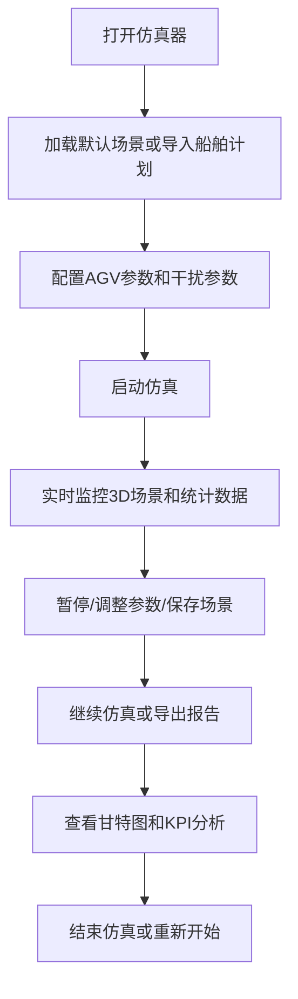

## 1. 产品概述

无人码头AGV集群调度仿真器是一个专业的港口物流仿真平台，用于模拟和优化自动化码头中AGV（自动导引车）集群的调度作业。该仿真器可帮助港口运营者测试不同调度策略、预测系统瓶颈、评估干扰影响，从而提升码头整体作业效率。

- **主要用途**：AGV集群调度算法验证、港口作业效率评估、干扰场景模拟、人员培训
- **目标用户**：港口运营管理者、物流系统工程师、调度算法研发人员
- **核心价值**：降低实际测试成本、提前发现系统瓶颈、优化资源配置、提升决策科学性

## 2. 核心功能

### 2.1 用户角色

| 角色 | 注册方式 | 核心权限 |
|------|----------|----------|
| 操作员 | 无需注册 | 运行仿真、调整参数、查看报告、保存/加载场景 |
| 管理员 | 无需注册 | 所有操作员权限 + 系统配置管理 |

### 2.2 功能模块

1. **虚拟码头场景**：3D可视化码头环境，包含岸桥、场桥、堆场箱区、AGV路径网络图
2. **AGV物理模型**：差速驱动运动学、DWA自动避障、电量管理模型
3. **调度算法引擎**：任务分配（贪心/匈牙利）、A*路径规划、死锁避免
4. **随机干扰模块**：AGV随机故障、岸桥作业时间波动
5. **场景管理**：多场景保存与加载功能
6. **可视化监控**：3D视角跟随、路网热力图、实时统计面板
7. **仿真控制**：启动/暂停/调速、船舶靠泊计划Excel导入
8. **报告导出**：作业时序甘特图、KPI效率瓶颈分析

### 2.3 页面详情

| 页面名称 | 模块名称 | 功能描述 |
|----------|----------|----------|
| 主仿真页面 | 3D场景视图 | 展示虚拟码头全景，支持视角切换、AGV选中跟随 |
| 主仿真页面 | 控制面板 | 仿真启动/暂停、调速（0.5x/1x/2x/10x）、时间显示 |
| 主仿真页面 | 实时统计面板 | 吞吐量TEU/小时、平均等待时间、AGV利用率 |
| 主仿真页面 | 路网热力图 | 红色拥堵/绿色空闲的路径占用可视化 |
| 场景管理弹窗 | 场景列表 | 已保存场景列表、加载/删除场景 |
| 场景管理弹窗 | 场景保存 | 输入场景名称、描述、保存当前状态 |
| 参数配置面板 | AGV参数 | 数量、速度、加速度、电池容量配置 |
| 参数配置面板 | 干扰参数 | AGV故障率、岸桥时间波动范围配置 |
| 船舶计划弹窗 | Excel导入 | 导入船舶靠泊计划Excel文件 |
| 报告页面 | 甘特图 | 作业时序可视化展示 |
| 报告页面 | KPI分析 | 效率瓶颈分析、各项指标统计 |

## 3. 核心流程

**核心流程说明**：
1. 用户进入仿真器后，可选择加载预设场景或导入真实船舶靠泊计划
2. 配置AGV数量、物理参数、干扰参数等仿真条件
3. 启动仿真后，系统自动执行任务分配、路径规划、AGV运动模拟
4. 用户可实时监控3D场景、查看统计数据、切换视角
5. 仿真过程中可随时暂停、调整参数、保存当前场景状态
6. 仿真结束后可导出包含甘特图和KPI分析的详细报告

## 4. 用户界面设计

### 4.1 设计风格
- **主色调**：深海蓝（#0A2463）作为主色，代表港口海洋元素
- **辅助色**：科技青（#3E92CC）、警示红（#D8315B）、活力绿（#3FB618）
- **中性色**：深灰（#1A1A2E）、浅灰（#F5F5F5）
- **按钮风格**：圆角矩形，带轻微阴影，悬停有缩放和发光效果
- **字体**：使用JetBrains Mono作为等宽字体（数据显示），Inter作为界面字体
- **布局风格**：暗色主题，科技感仪表盘布局，左侧控制面板，右侧3D场景，底部状态栏
- **图标**：使用Lucide图标库，线条风格统一

### 4.2 页面设计概述

| 页面名称 | 模块名称 | UI元素 |
|----------|----------|--------|
| 主仿真页面 | 3D场景容器 | 全屏WebGL渲染区域，支持鼠标拖拽旋转、滚轮缩放 |
| 主仿真页面 | 左侧控制面板 | 折叠式面板，包含仿真控制、参数配置、场景管理 |
| 主仿真页面 | 顶部状态栏 | 仿真时间、运行状态、速度倍率、TEU计数器 |
| 主仿真页面 | 右侧统计面板 | 半透明卡片，实时数据曲线、热力图开关 |
| 主仿真页面 | 底部AGV列表 | 横向滚动AGV状态卡片，显示电量、状态、当前任务 |
| 报告页面 | 甘特图区域 | 时间轴横向布局，不同颜色代表不同作业类型 |
| 报告页面 | KPI卡片网格 | 6-8个指标卡片，包含数值、趋势箭头、排名 |

### 4.3 响应式
- 桌面端优先设计，最小支持1280px宽度
- 控制面板可折叠，最大化3D场景显示区域
- 统计面板支持拖拽调整位置和大小

### 4.4 3D场景指导
- **环境**：工业港口风格，深蓝色天空，海面反射效果，码头地面为灰色混凝土地面
- **光照**：半球光 + 方向光模拟日光，AGV和设备使用自发光材质增强科技感
- **相机**：默认俯视45度角，支持自由视角和AGV跟随视角
- **模型风格**：低多边形风格，岸桥/场桥使用金属质感材质，AGV使用发光标识
- **动画**：AGV移动平滑插值，岸桥/场桥作业有机械臂动画，集装箱装卸有粒子特效
- **后处理**：轻微泛光效果，增强科技感，SSAO增强空间感
- **性能**：AGV数量建议控制在50以内，使用InstancedMesh优化渲染性能
