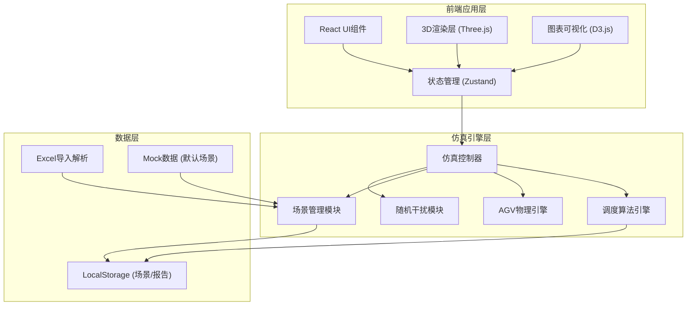

## 1. 架构设计



## 2. 技术描述

- **前端框架**：React 18 + TypeScript + Vite 5
- **状态管理**：Zustand 4
- **样式方案**：TailwindCSS 3 + CSS Modules
- **3D渲染**：Three.js 0.160 + @react-three/fiber 8 + @react-three/drei 9
- **图表可视化**：D3.js 7
- **Excel处理**：SheetJS (xlsx) 0.18
- **路由**：React Router Dom 6
- **图标**：Lucide React
- **后端**：无（纯前端应用，数据存储于LocalStorage）

## 3. 目录结构

```
src/
├── components/          # UI组件
│   ├── ControlPanel/    # 控制面板
│   ├── StatsPanel/      # 统计面板
│   ├── AGVList/         # AGV列表
│   ├── SceneManager/    # 场景管理
│   ├── ReportModal/     # 报告弹窗
│   └── common/          # 通用组件
├── pages/
│   ├── SimulatorPage.tsx    # 主仿真页面
│   └── ReportPage.tsx       # 报告页面
├── store/               # Zustand状态管理
│   ├── useSimulationStore.ts
│   ├── useAGVStore.ts
│   └── useSceneStore.ts
├── engine/              # 仿真引擎
│   ├── SimulationEngine.ts
│   ├── AGVPhysics.ts
│   ├── Scheduler.ts
│   ├── PathPlanner.ts
│   └── Interference.ts
├── three/               # 3D相关
│   ├── Scene.tsx
│   ├── AGVModel.tsx
│   ├── QuayCrane.tsx
│   ├── YardCrane.tsx
│   └── Heatmap.tsx
├── utils/               # 工具函数
│   ├── excelParser.ts
│   ├── math.ts
│   └── constants.ts
├── types/               # TypeScript类型定义
│   └── index.ts
└── mock/                # Mock数据
    └── defaultScene.ts
```

## 4. 路由定义

| 路由 | 页面 | 功能 |
|------|------|------|
| / | SimulatorPage | 主仿真页面，包含3D场景、控制面板、统计面板 |
| /report | ReportPage | 报告页面，展示甘特图和KPI分析 |

## 5. 数据模型

### 5.1 核心数据类型

```typescript
// AGV状态
interface AGV {
  id: string;
  position: { x: number; y: number; angle: number };
  velocity: { linear: number; angular: number };
  battery: number;        // 电量 0-100
  status: 'idle' | 'moving' | 'loading' | 'unloading' | 'charging' | 'fault';
  currentTask: Task | null;
  path: PathPoint[];
  maxSpeed: number;       // m/s
  maxAcceleration: number; // m/s²
  totalDistance: number;  // 行驶总距离 km
}

// 任务
interface Task {
  id: string;
  type: 'quay_to_yard' | 'yard_to_quay';
  containerId: string;
  origin: { x: number; y: number };
  destination: { x: number; y: number };
  priority: number;
  status: 'pending' | 'assigned' | 'in_progress' | 'completed';
  assignedAGV: string | null;
  createdAt: number;
  completedAt: number | null;
}

// 岸桥
interface QuayCrane {
  id: string;
  position: { x: number; y: number };
  status: 'idle' | 'working';
  currentShip: string | null;
  operationTime: number;  // 单次作业时间（秒）
  timeVariation: number;  // 时间波动范围 0-1
}

// 场桥
interface YardCrane {
  id: string;
  position: { x: number; y: number };
  status: 'idle' | 'working';
  operationTime: number;
}

// 堆场箱区
interface YardBlock {
  id: string;
  position: { x: number; y: number; width: number; height: number };
  capacity: number;
  currentContainers: number;
}

// 路网节点
interface RoadNode {
  id: string;
  position: { x: number; y: number };
  connections: string[];  // 连接的其他节点ID
  congestion: number;     // 拥堵程度 0-1
}

// 仿真状态
interface SimulationState {
  isRunning: boolean;
  speed: number;          // 0.5, 1, 2, 10
  currentTime: number;    // 仿真时间（秒）
  totalTEU: number;
  averageWaitTime: number;
  agvUtilization: number;
}

// 场景
interface Scene {
  id: string;
  name: string;
  description: string;
  createdAt: number;
  agvs: AGV[];
  quayCranes: QuayCrane[];
  yardCranes: YardCrane[];
  yardBlocks: YardBlock[];
  roadNetwork: RoadNode[];
  tasks: Task[];
  simulationState: SimulationState;
}

// 船舶靠泊计划
interface ShipSchedule {
  shipName: string;
  arrivalTime: number;
  departureTime: number;
  containerCount: number;
  quayCraneId: string;
}

// KPI报告
interface KPIReport {
  totalTEU: number;
  teuPerHour: number;
  averageWaitTime: number;
  maxWaitTime: number;
  agvUtilization: number;
  craneUtilization: number;
  deadlockCount: number;
  faultCount: number;
  taskCompletionRate: number;
  ganttData: GanttItem[];
  bottleneckAnalysis: BottleneckItem[];
}

interface GanttItem {
  id: string;
  name: string;
  type: string;
  startTime: number;
  endTime: number;
  resource: string;
}

interface BottleneckItem {
  name: string;
  severity: 'low' | 'medium' | 'high';
  description: string;
  suggestion: string;
}
```

### 5.2 核心算法模块

**A*路径规划算法**：
- 输入：起点、终点、路网图、拥堵加权
- 输出：最优路径节点序列
- 启发函数：欧几里得距离
- 代价函数：路径长度 + 拥堵系数 × 通过时间

**DWA动态窗口避障**：
- 输入：AGV当前状态、目标点、障碍物列表
- 输出：最优线速度和角速度
- 评价函数：朝向目标程度 + 速度 + 障碍物距离

**匈牙利任务分配算法**：
- 输入：AGV列表、待分配任务列表、代价矩阵
- 输出：最优任务分配方案
- 最小化总行驶距离或总等待时间

**银行家死锁避免**：
- 输入：资源需求矩阵、已分配资源矩阵、可用资源向量
- 输出：安全序列或死锁预警

## 6. 状态管理设计

使用Zustand管理全局状态，分为三个主要store：

1. **useSimulationStore** - 仿真控制状态
   - 运行状态、速度倍率、当前时间
   - 启动/暂停/重置方法
   - 统计数据更新

2. **useAGVStore** - AGV相关状态
   - AGV列表、位置、状态
   - 选中AGV、视角跟随

3. **useSceneStore** - 场景管理状态
   - 当前场景、已保存场景列表
   - 保存/加载/删除场景方法

## 7. 仿真循环

```
requestAnimationFrame
    ↓
计算deltaTime × speed倍率
    ↓
更新所有AGV物理状态（位置、速度、电量）
    ↓
检查AGV避障和路径调整
    ↓
调度器分配新任务
    ↓
检查任务完成状态
    ↓
触发随机干扰（故障、时间波动）
    ↓
更新统计数据（TEU、等待时间、利用率）
    ↓
更新3D场景渲染
    ↓
更新UI统计面板
```

## 8. 性能优化策略

1. **3D渲染优化**：
   - 使用InstancedMesh渲染大量AGV和集装箱
   - 视锥体剔除，只渲染可见区域
   - LOD（层次细节）技术

2. **计算优化**：
   - 路径规划使用Web Worker异步计算
   - 物理更新使用固定时间步长
   - 空间分区算法加速碰撞检测

3. **UI优化**：
   - 使用React.memo避免不必要重渲染
   - 统计数据节流更新（每100ms更新一次）
   - 虚拟滚动处理大量AGV列表
