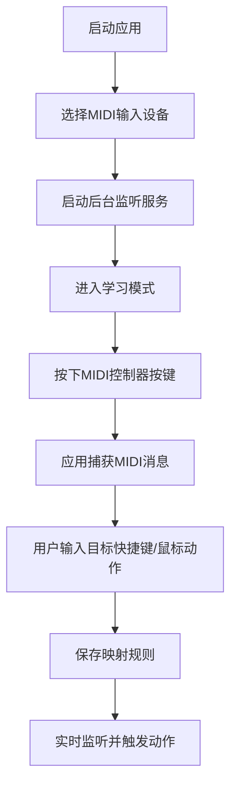
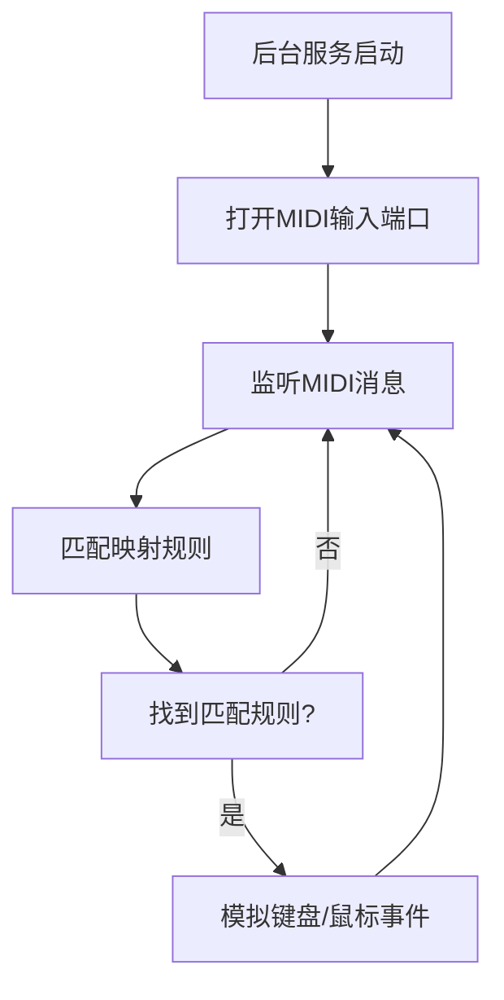

## 1. 产品概述

MIDI控制器映射器是一款桌面应用，用于将MIDI设备（如MIDI键盘、打击垫、控制器）的输入信号映射为键盘快捷键或鼠标操作，实现音乐制作软件、游戏、直播工具等任意桌面软件的快捷控制。

- 核心价值：让音乐制作人、游戏玩家、直播主通过MIDI硬件快速控制桌面软件，提升工作效率
- 目标用户：音乐制作人、DJ、游戏玩家、直播主播、内容创作者

## 2. 核心功能

### 2.1 用户角色
| 角色 | 注册方式 | 核心权限 |
|------|----------|----------|
| 普通用户 | 无需注册 | 创建/编辑映射配置、导入导出配置、启动/停止后台服务 |

### 2.2 功能模块
1. **主控制页面**：设备选择、服务启停、配置管理、学习模式开关
2. **映射配置页面**：MIDI信号学习、快捷键/鼠标宏绑定、映射规则列表
3. **设置页面**：通用设置、开机自启、托盘运行

### 2.3 页面详情
| 页面名称 | 模块名称 | 功能描述 |
|-----------|-------------|---------------------|
| 主控制页面 | 设备管理 | 扫描并显示可用MIDI输入设备，支持设备选择和连接状态显示 |
| 主控制页面 | 服务控制 | 启动/停止后台监听服务，显示服务运行状态 |
| 主控制页面 | 配置管理 | 配置文件列表、新建/切换/删除/重命名配置 |
| 主控制页面 | 导入导出 | JSON配置文件的导入和导出功能 |
| 映射配置页面 | MIDI学习 | 点击"学习"按钮后捕获MIDI输入信号（通道、音符、力度） |
| 映射配置页面 | 动作绑定 | 为MIDI信号绑定键盘快捷键或鼠标宏（点击、拖拽、滚动） |
| 映射配置页面 | 映射列表 | 显示所有映射规则，支持编辑、删除、启用/禁用 |
| 设置页面 | 通用设置 | 开机自启、最小化到托盘、日志级别 |
| 设置页面 | 关于 | 版本信息、帮助链接 |

## 3. 核心流程

### 用户创建映射流程

### 后台服务运行流程

## 4. 用户界面设计

### 4.1 设计风格
- **设计方向**：科技感+专业工具风，深色主题为主，适合音乐制作场景
- **主色调**：深靛蓝 `#1a1a2e` 背景，霓虹青 `#00d9ff` 主强调色，霓虹紫 `#9d4edd` 辅助色
- **按钮风格**：圆角矩形，发光hover效果，按下时有凹陷动画
- **字体**：JetBrains Mono 等宽字体用于技术数据显示，Inter 用于界面文本
- **布局**：左侧导航栏 + 右侧主内容区，卡片式模块布局
- **图标风格**：线性图标，霓虹发光效果

### 4.2 页面设计概述
| 页面名称 | 模块名称 | UI元素 |
|-----------|-------------|-------------|
| 主控制页面 | 设备面板 | 设备选择下拉框、连接状态指示灯、MIDI信号活动指示器 |
| 主控制页面 | 服务控制 | 大号启动/停止按钮、运行状态徽章、实时日志预览 |
| 主控制页面 | 配置管理 | 配置卡片网格、当前配置高亮、操作按钮组 |
| 映射配置页面 | 学习模式 | 呼吸灯效果的学习按钮、MIDI信号捕获动画、参数显示区 |
| 映射配置页面 | 动作绑定 | 快捷键录制输入框、鼠标动作录制面板、坐标显示 |
| 映射配置页面 | 映射列表 | 可排序表格、启用/禁用开关、快速编辑按钮 |
| 设置页面 | 设置列表 | 开关组件、下拉选择、输入框 |

### 4.3 响应性
- 桌面端为主，支持窗口大小调整
- 最小窗口尺寸：800x600
- 面板支持拖拽调整大小

### 4.4 动效设计
- MIDI信号捕获时的波形动画
- 学习模式下的呼吸灯效果
- 服务启动/停止的平滑过渡
- 快捷键触发时的视觉反馈
- 列表项的进入/退出动画
