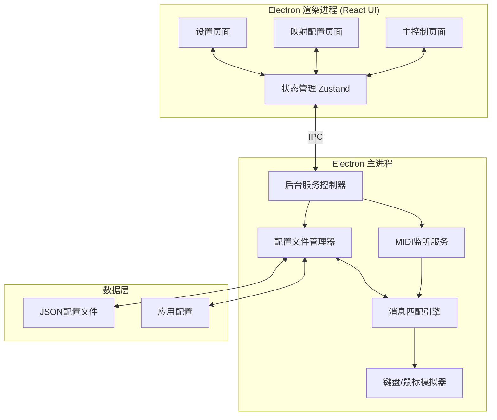

## 1. 架构设计



## 2. 技术描述

### 2.1 核心技术栈
| 层级 | 技术选型 | 版本 | 用途 |
|------|----------|------|------|
| 桌面框架 | Electron | ^28.0.0 | 跨平台桌面应用 |
| 前端框架 | React | ^18.2.0 | UI组件开发 |
| 语言 | TypeScript | ^5.3.0 | 类型安全 |
| 构建工具 | Vite | ^5.0.0 | 快速构建和热更新 |
| 样式框架 | TailwindCSS | ^3.4.0 | 原子化CSS |
| 状态管理 | Zustand | ^4.4.0 | 轻量状态管理 |
| 动画库 | framer-motion | ^10.16.0 | 流畅动效 |
| MIDI通信 | @julusian/midi | ^3.2.0 | MIDI设备输入输出 |
| 键鼠模拟 | @nut-tree/nut-js | ^3.1.0 | 跨平台键盘鼠标控制 |
| 图标 | lucide-react | ^0.294.0 | 图标库 |

### 2.2 项目结构
```
src/
├── main/                 # Electron 主进程
│   ├── index.ts          # 主进程入口
│   ├── midi/             # MIDI相关模块
│   │   ├── DeviceManager.ts
│   │   ├── MidiListener.ts
│   │   └── types.ts
│   ├── input/            # 输入模拟模块
│   │   ├── KeyboardSimulator.ts
│   │   ├── MouseSimulator.ts
│   │   └── types.ts
│   ├── config/           # 配置管理
│   │   ├── ConfigManager.ts
│   │   ├── ProfileManager.ts
│   │   └── types.ts
│   ├── service/          # 后台服务
│   │   ├── BackgroundService.ts
│   │   └── MapperEngine.ts
│   └── ipc/              # IPC通信
│       ├── handlers.ts
│       └── channels.ts
├── renderer/             # Electron 渲染进程
│   ├── main.tsx          # React入口
│   ├── App.tsx           # 根组件
│   ├── store/            # 状态管理
│   │   ├── useAppStore.ts
│   │   └── useMidiStore.ts
│   ├── components/       # UI组件
│   │   ├── Layout/
│   │   ├── DevicePanel/
│   │   ├── ServiceControl/
│   │   ├── MappingList/
│   │   ├── LearnMode/
│   │   └── ActionBinder/
│   ├── pages/            # 页面组件
│   │   ├── Dashboard.tsx
│   │   ├── Mappings.tsx
│   │   └── Settings.tsx
│   ├── hooks/            # 自定义Hooks
│   │   ├── useMidiDevices.ts
│   │   ├── useLearnMode.ts
│   │   └── useKeyboardCapture.ts
│   ├── utils/            # 工具函数
│   │   ├── midi.ts
│   │   ├── keyboard.ts
│   │   └── ipc.ts
│   └── types/            # 类型定义
└── shared/               # 共享类型
    └── index.ts
```

## 3. 核心数据模型

### 3.1 MIDI消息模型
```typescript
interface MidiMessage {
  status: number;      // 状态字节 (note on/off, cc, etc.)
  channel: number;     // MIDI通道 (0-15)
  type: 'noteOn' | 'noteOff' | 'cc' | 'pitchBend' | 'aftertouch';
  note?: number;       // 音符编号 (0-127)
  velocity?: number;   // 力度值 (0-127)
  controlNumber?: number; // CC控制器编号
  controlValue?: number;  // CC控制器值
  timestamp: number;   // 时间戳
}
```

### 3.2 动作模型
```typescript
type ActionType = 'keyboard' | 'mouseClick' | 'mouseDrag' | 'mouseScroll';

interface KeyboardAction {
  type: 'keyboard';
  keys: string[];       // 按键组合 ['ctrl', 'shift', 'a']
  hold?: boolean;       // 是否保持按下
  duration?: number;    // 持续时间(ms)
}

interface MouseClickAction {
  type: 'mouseClick';
  button: 'left' | 'right' | 'middle';
  x?: number;           // 点击X坐标，不填则当前位置
  y?: number;           // 点击Y坐标
  doubleClick?: boolean;
}

interface MouseDragAction {
  type: 'mouseDrag';
  fromX: number;
  fromY: number;
  toX: number;
  toY: number;
  button: 'left' | 'right' | 'middle';
  duration?: number;    // 拖拽持续时间
}

interface MouseScrollAction {
  type: 'mouseScroll';
  direction: 'up' | 'down' | 'left' | 'right';
  amount: number;       // 滚动量
}

type Action = KeyboardAction | MouseClickAction | MouseDragAction | MouseScrollAction;
```

### 3.3 映射规则模型
```typescript
interface MappingRule {
  id: string;
  name: string;
  enabled: boolean;
  midiTrigger: {
    type: 'note' | 'cc' | 'pitchBend';
    channel: number;
    note?: number;           // 对于note类型
    controlNumber?: number;  // 对于cc类型
    minVelocity?: number;    // 最小触发力度
    maxVelocity?: number;    // 最大触发力度
    threshold?: number;      // 触发阈值 (用于cc)
  };
  action: Action;
  createdAt: number;
  updatedAt: number;
}
```

### 3.4 配置文件模型
```typescript
interface Profile {
  id: string;
  name: string;
  description?: string;
  deviceName?: string;       // 关联的MIDI设备名
  mappings: MappingRule[];
  createdAt: number;
  updatedAt: number;
}

interface AppConfig {
  autoStart: boolean;
  minimizeToTray: boolean;
  startServiceOnLaunch: boolean;
  activeProfileId: string | null;
  selectedDeviceId: string | null;
  logLevel: 'debug' | 'info' | 'warn' | 'error';
  profiles: Profile[];
}
```

## 4. IPC通信定义

### 4.1 通道定义
```typescript
enum IpcChannel {
  // MIDI设备相关
  MIDI_GET_DEVICES = 'midi:get-devices',
  MIDI_SELECT_DEVICE = 'midi:select-device',
  MIDI_START_LEARN = 'midi:start-learn',
  MIDI_STOP_LEARN = 'midi:stop-learn',
  MIDI_MESSAGE_RECEIVED = 'midi:message-received',
  
  // 服务控制
  SERVICE_START = 'service:start',
  SERVICE_STOP = 'service:stop',
  SERVICE_STATUS = 'service:status',
  
  // 配置管理
  CONFIG_GET = 'config:get',
  CONFIG_SAVE = 'config:save',
  PROFILE_CREATE = 'profile:create',
  PROFILE_DELETE = 'profile:delete',
  PROFILE_SWITCH = 'profile:switch',
  PROFILE_EXPORT = 'profile:export',
  PROFILE_IMPORT = 'profile:import',
  
  // 映射管理
  MAPPING_ADD = 'mapping:add',
  MAPPING_UPDATE = 'mapping:update',
  MAPPING_DELETE = 'mapping:delete',
  
  // 动作测试
  ACTION_TEST = 'action:test',
}
```

## 5. 配置文件格式

### 5.1 JSON配置文件结构
```json
{
  "version": "1.0",
  "profile": {
    "id": "uuid",
    "name": "默认配置",
    "description": "音乐制作快捷键",
    "deviceName": "MIDI Keyboard 61",
    "mappings": [
      {
        "id": "uuid",
        "name": "播放/暂停",
        "enabled": true,
        "midiTrigger": {
          "type": "note",
          "channel": 0,
          "note": 60,
          "minVelocity": 0,
          "maxVelocity": 127
        },
        "action": {
          "type": "keyboard",
          "keys": ["space"]
        },
        "createdAt": 1700000000000,
        "updatedAt": 1700000000000
      }
    ]
  }
}
```

## 6. 构建配置

### 6.1 构建脚本
- `npm run dev` - 开发模式，启动Vite + Electron
- `npm run build` - 构建生产版本
- `npm run build:win` - 构建Windows安装包
- `npm run build:mac` - 构建macOS安装包
- `npm run lint` - 代码检查
- `npm run typecheck` - 类型检查

### 6.2 原生模块处理
- `@julusian/midi` 和 `@nut-tree/nut-js` 需要在Electron中正确重建
- 使用 `electron-builder` 配置 `npmRebuild: true`
- 配置 `buildDependenciesFromSource: true` 确保原生模块兼容
