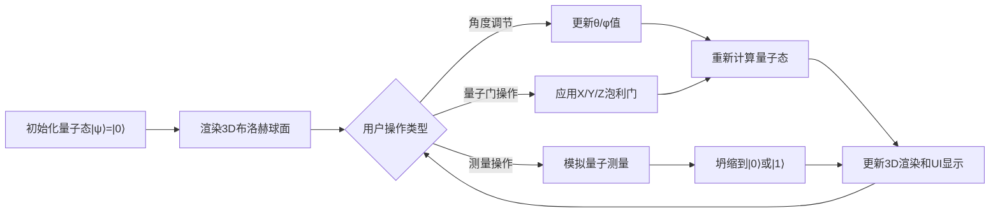

## 1. 产品概述
单量子比特布洛赫球面可视化模拟器，用于量子计算教学与演示。用户可通过交互式3D界面直观理解量子态、泡利门操作和量子测量的概念。
- 主要目的：将抽象的量子计算概念可视化，帮助学习者理解布洛赫球面表示
- 目标用户：量子计算初学者、学生、研究人员

## 2. 核心功能

### 2.1 功能模块
1. **3D布洛赫球面主视图**：可拖拽旋转、缩放的3D球面，显示量子态向量
2. **角度控制面板**：θ（极角）和φ（方位角）滑块，实时更新量子态
3. **量子门控制面板**：X/Y/Z泡利门按钮，对当前态应用门操作
4. **测量控制面板**：测量按钮，模拟量子坍缩并显示概率分布
5. **状态信息侧边栏**：实时显示量子态的复数振幅和布洛赫球坐标

### 2.2 页面详情
| 页面名称 | 模块名称 | 功能描述 |
|-----------|-------------|---------------------|
| 主页面 | 3D布洛赫球面 | Three.js渲染的交互式3D球面，支持鼠标拖拽旋转、滚轮缩放 |
| 主页面 | 角度控制区 | 两个滑块分别控制θ(0-π)和φ(0-2π)，实时更新态向量 |
| 主页面 | 量子门控制区 | 三个泡利门按钮（X/Y/Z），点击后执行量子门操作 |
| 主页面 | 测量控制区 | 测量按钮触发测量模拟，柱状图显示|0⟩和|1⟩的概率 |
| 主页面 | 状态信息侧边栏 | 显示α、β复数振幅，以及θ、φ坐标值 |

## 3. 核心流程

## 4. 用户界面设计

### 4.1 设计风格
- **主色调**：深蓝科技感主题（#0a1628），量子态向量使用青色（#00d4ff）
- **辅助色**：X门红色（#ff4757）、Y门绿色（#2ed573）、Z门紫色（#a55eea）
- **按钮风格**：圆角矩形，发光悬停效果，按压动画
- **字体**：使用JetBrains Mono作为代码字体，搭配现代无衬线字体
- **布局风格**：居中3D场景，左侧控制面板，右侧状态信息栏，玻璃拟态卡片

### 4.2 页面设计概述
| 页面名称 | 模块名称 | UI元素 |
|-----------|-------------|-------------|
| 主页面 | 3D场景区域 | 居中显示，背景深空渐变，球面网格线，坐标轴标记 |
| 主页面 | 左侧控制面板 | 玻璃拟态卡片，包含滑块、按钮、柱状图 |
| 主页面 | 右侧信息栏 | 半透明侧边栏，显示数学公式和数值 |
| 主页面 | 标题区域 | 顶部渐变文字标题，简洁导航 |

### 4.3 响应式
- 桌面端优先设计，左侧控制面板280px，右侧信息栏260px
- 平板端自动调整面板宽度
- 移动端采用堆叠布局

### 4.4 3D场景指引
- **环境**：深空渐变背景，微弱粒子效果
- **光照**：环境光 + 主方向光，球面有柔和高光
- **相机设置**：PerspectiveCamera，初始距离4，允许轨道控制
- **交互**：OrbitControls实现拖拽旋转、滚轮缩放、右键平移
- **动画**：量子态向量更新时有平滑过渡动画
- **后处理**：Bloom效果增强科技感
