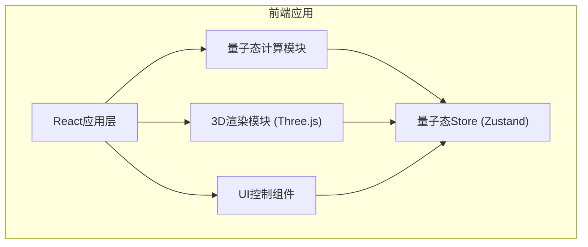

## 1. 架构设计


## 2. 技术描述
- **前端框架**: React@18 + TypeScript + Vite
- **3D渲染**: Three.js + @react-three/fiber + @react-three/drei
- **状态管理**: Zustand (轻量级状态管理)
- **样式方案**: TailwindCSS@3
- **数学计算**: 原生复数运算

## 3. 目录结构
```
src/
├── components/
│   ├── BlochSphere/      # 3D布洛赫球面组件
│   ├── ControlPanel/     # 控制面板组件
│   ├── StateSidebar/     # 状态信息侧边栏
│   └── ProbabilityChart/ # 概率分布柱状图
├── store/
│   └── quantumStore.ts   # 量子态状态管理
├── utils/
│   └── quantumMath.ts    # 量子计算工具函数
├── types/
│   └── quantum.ts        # TypeScript类型定义
├── App.tsx
└── main.tsx
```

## 4. 核心数据模型

### 4.1 量子态类型定义
```typescript
interface QuantumState {
  theta: number;      // 极角 (0 ~ π)
  phi: number;        // 方位角 (0 ~ 2π)
  alpha: Complex;     // |0⟩ 振幅
  beta: Complex;      // |1⟩ 振幅
  probability0: number; // |0⟩ 概率
  probability1: number; // |1⟩ 概率
}

interface Complex {
  re: number;  // 实部
  im: number;  // 虚部
}
```

### 4.2 泡利门矩阵
```typescript
// X门 (NOT门)
const X_GATE = [[0, 1], [1, 0]]

// Y门
const Y_GATE = [[0, {re:0, im:-1}], [{re:0, im:1}, 0]]

// Z门
const Z_GATE = [[1, 0], [0, -1]]
```

## 5. 核心函数定义

### 5.1 量子计算工具函数
```typescript
// 从角度计算量子态
function anglesToState(theta: number, phi: number): QuantumState

// 应用量子门
function applyGate(state: QuantumState, gate: Matrix): QuantumState

// 量子测量
function measure(state: QuantumState): '0' | '1'

// 复数乘法
function complexMult(a: Complex, b: Complex): Complex

// 复数模长平方
function complexAbsSq(c: Complex): number
```

### 5.2 布洛赫坐标转换
```typescript
// 量子态 → 笛卡尔坐标
function stateToCartesian(theta: number, phi: number): {x: number, y: number, z: number}
```
