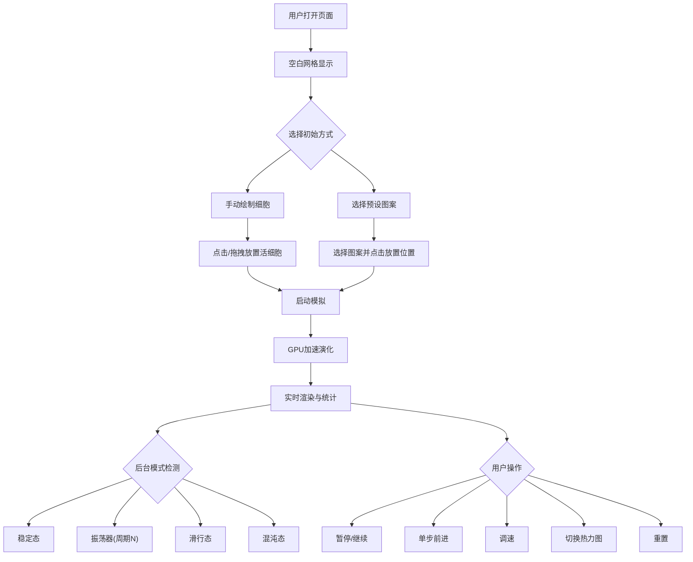

## 1. 产品概述

GPU加速的康威生命游戏模拟器——基于WebGL2实现大规模并行细胞自动机模拟，支持512×512以上网格的实时交互编辑、GPU加速演化、模式检测与热力图可视化。

- 目标用户：细胞自动机爱好者、算法研究者、创意编程社区
- 核心价值：将传统CPU模拟提升至GPU并行计算级别，实现大规模网格的实时交互与智能分析

## 2. 核心功能

### 2.1 功能模块

1. **模拟器主页面**：全屏Canvas网格渲染 + 控制面板 + 统计面板 + 模式检测面板

### 2.2 页面详情

| 页面名称 | 模块名称 | 功能描述 |
|---------|---------|---------|
| 模拟器主页面 | WebGL2 Canvas | GPU加速的512×512+网格渲染，支持缩放与平移 |
| 模拟器主页面 | 交互编辑器 | 点击/拖拽放置活细胞，右键擦除，支持画笔大小调节 |
| 模拟器主页面 | 预设图案 | 滑翔机、滑翔机群、脉冲星、高斯帕滑翔机枪、LWSS等一键放置 |
| 模拟器主页面 | 模拟控制 | 播放/暂停、单步前进、速度调节（1-60步/秒）、重置 |
| 模拟器主页面 | 实时统计 | 活细胞数量、世代数、细胞密度、帧率FPS |
| 模拟器主页面 | 热力图模式 | 颜色编码每个格子的"年龄"（上次状态变化的世代差） |
| 模拟器主页面 | 模式检测 | 后台Web Worker分析演化模式：稳定态、振荡器（含周期）、滑行态、混沌态 |

## 3. 核心流程

用户打开页面后看到空白网格，可通过点击/拖拽绘制初始图案或选择预设图案，然后启动模拟观察演化过程。模拟运行时实时展示统计数据，后台Web Worker周期性分析模式类型。

## 4. 用户界面设计

### 4.1 设计风格

- **主色调**：深色赛博朋克风——深墨黑(#0a0e17)背景，霓虹青(#00ffc8)主强调色，电紫(#a855f7)副强调色
- **按钮风格**：半透明玻璃态(glassmorphism)，圆角8px，悬停发光效果
- **字体**：显示字体 JetBrains Mono（等宽编程风），UI字体系统默认
- **布局风格**：左侧Canvas主区域 + 右侧控制面板，面板可折叠
- **图标风格**：线性图标（Lucide）

### 4.2 页面设计概览

| 页面名称 | 模块名称 | UI元素 |
|---------|---------|--------|
| 模拟器主页面 | WebGL2 Canvas | 占满左侧空间，深色背景，活细胞霓虹青，网格线微弱显示 |
| 模拟器主页面 | 控制面板 | 右侧半透明面板，播放/暂停按钮、步进按钮、速度滑块、预设图案下拉、画笔大小 |
| 模拟器主页面 | 统计面板 | 控制面板顶部，数字以大号等宽字体显示：世代数、活细胞、密度、FPS |
| 模拟器主页面 | 模式检测 | 控制面板底部，带颜色标签显示当前模式（绿=稳定、蓝=振荡、橙=滑行、红=混沌） |
| 模拟器主页面 | 热力图切换 | 切换按钮，开启后细胞颜色从蓝(新)→青→黄→红(老)渐变 |

### 4.3 响应式设计

- 桌面优先设计，Canvas区域自适应窗口大小
- 面板在小屏幕下自动折叠为底部抽屉
- 支持鼠标滚轮缩放和触摸板手势

### 4.4 动效设计

- 活细胞出现/消失时带微弱脉冲动画（shader实现）
- 统计数字变化时的数值滚动效果
- 模式检测标签切换时的淡入淡出
- 面板展开/折叠的滑动动画
