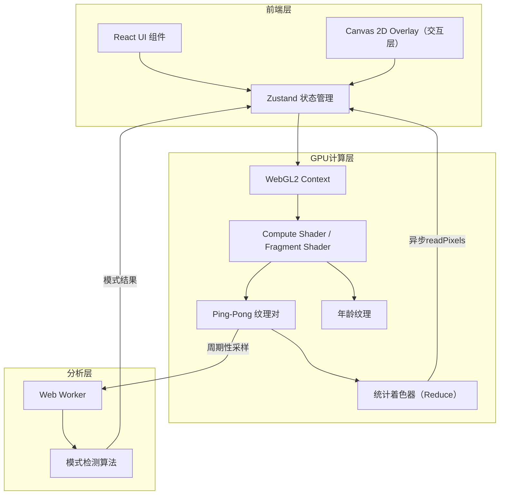

## 1. 架构设计



## 2. 技术说明

- **前端**：React@18 + TypeScript + Tailwind CSS + Vite
- **GPU计算**：WebGL2 Fragment Shader实现（Compute Shader需WebGPU，当前用Fragment Shader + FBO ping-pong实现同等效果）
- **状态管理**：Zustand
- **后台分析**：Web Worker（内联Worker，无需额外文件）
- **无后端**：纯前端应用

### 核心技术方案

#### 2.1 GPU模拟——Ping-Pong纹理

- 使用两张浮点纹理（R8格式即可）交替读写
- Fragment Shader中读取当前状态纹理，写入下一状态纹理
- 环绕边界条件在shader中用`mod()`实现

#### 2.2 热力图——年龄纹理

- 额外维护一张年龄纹理（R16F），记录每个格子上次状态变化的世代
- 每帧在shader中：若状态改变则写入当前世代，否则保留原值
- 渲染时根据 `(currentGen - age)` 映射颜色

#### 2.3 统计数据——GPU Reduce

- 使用mipmap级联reduce或分块统计shader统计活细胞数
- 避免每帧`readPixels`阻塞：只在需要时（每N帧）异步读取
- 利用`gl.readPixels`的`PIXEL_PACK_BUFFER`异步读取（WebGL2支持）

#### 2.4 模式检测——Web Worker

- 周期性（如每30帧）从GPU读取网格快照发送到Worker
- Worker中执行：
  - 哈希比较：当前帧与历史帧的哈希，检测稳定态和振荡器
  - 质心偏移检测：判断是否为滑行态
  - 熵计算：评估混沌程度
- 结果通过`postMessage`返回主线程

#### 2.5 CPU-GPU交互优化

- 统计数据通过GPU Reduce Shader计算，仅在需要时异步readPixels
- 交互编辑通过`texSubImage2D`局部更新纹理，而非全量传输
- 模式检测采样使用低频（每30帧一次），减小带宽压力

## 3. 路由定义

| 路由 | 用途 |
|------|------|
| / | 模拟器主页面 |

## 4. 数据模型

### 4.1 核心状态定义

```typescript
interface SimState {
  gridSize: number;
  generation: number;
  isRunning: boolean;
  speed: number;
  liveCells: number;
  density: number;
  fps: number;
  heatmapEnabled: boolean;
  brushSize: number;
  selectedPattern: string | null;
  detectedMode: 'stable' | 'oscillator' | 'glider' | 'chaos' | 'unknown';
  oscillatorPeriod: number | null;
}
```

### 4.2 预设图案数据

预设图案以坐标数组形式存储，放置时相对于点击位置偏移。
