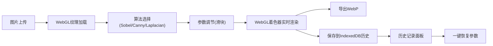

## 1. 产品概述
纯前端WebGL加速的边缘检测图像处理工具，支持Sobel、Canny、Laplacian三种经典算法，提供实时参数调节、历史记录缓存和性能监控功能。
- 面向设计师、开发者和图像处理爱好者，提供无需后端的高性能边缘检测体验
- 核心价值在于WebGL GPU加速带来的实时预览能力，以及完善的历史管理和导出功能

## 2. 核心功能

### 2.1 功能模块
1. **主处理页面**：图片上传区、算法选择器、参数调节面板、实时预览画布
2. **历史记录面板**：IndexedDB缓存的处理历史列表，支持一键恢复
3. **性能监控面板**：FPS计数器、GPU内存占用、处理耗时对比图表

### 2.2 页面详情
| 页面名称 | 模块名称 | 功能描述 |
|---------|---------|----------|
| 主处理页面 | 图片上传区 | 支持拖拽上传、点击选择文件、粘贴图片，支持JPG/PNG/WebP格式 |
| 主处理页面 | 算法选择器 | 三选一：Sobel算子、Canny边缘检测、Laplacian算子，带算法说明 |
| 主处理页面 | 参数调节面板 | 滑块调节：低阈值、高阈值（Canny）、卷积核大小（3x3/5x5/7x7）、强度 |
| 主处理页面 | 实时预览画布 | WebGL渲染，支持原图/结果对比查看，缩放拖动 |
| 主处理页面 | 导出功能 | 一键导出为WebP格式，支持质量调节 |
| 历史记录面板 | 历史列表 | 显示最近20条处理记录，缩略图+算法+参数+时间 |
| 历史记录面板 | 历史操作 | 恢复参数、删除单条、清空全部 |
| 性能监控面板 | FPS计数器 | 实时帧率显示，目标60fps |
| 性能监控面板 | GPU内存占用 | WebGL纹理内存估算 |
| 性能监控面板 | 耗时对比图 | 三种算法处理耗时柱状图，可刷新对比 |

## 3. 核心流程

用户上传图片 → 选择边缘检测算法 → 调节参数实时预览 → 导出WebP或保存到历史记录

## 4. 用户界面设计

### 4.1 设计风格
- **主色调**：深空蓝 (#0F172A) 背景，霓虹青 (#06B6D4) 作为主强调色，荧光紫 (#8B5CF6) 作为次强调色
- **按钮风格**：玻璃拟态效果，圆角8px，悬停时发光效果
- **字体**：使用 JetBrains Mono 作为等宽字体（代码/参数显示），Inter 作为界面字体
- **布局风格**：三栏式布局，左侧控制面板，中间预览区，右侧性能+历史面板
- **视觉元素**：网格背景、扫描线效果、故障艺术（glitch）过渡动画

### 4.2 页面设计概述
| 页面名称 | 模块名称 | UI Elements |
|---------|---------|-------------|
| 主处理页面 | 图片上传区 | 虚线边框，拖拽高亮，文件图标动画 |
| 主处理页面 | 参数滑块 | 自定义轨道，发光滑块头，实时数值显示 |
| 主处理页面 | 预览画布 | 深色背景，网格参考线，对比分割线 |
| 主处理页面 | 算法选项卡 | 选中状态发光，切换时着色器过渡动画 |
| 历史记录面板 | 历史卡片 | 悬停放大，缩略图，时间戳 |
| 性能监控面板 | 数据图表 | 动态柱状图，数值跳动动画 |

### 4.3 响应式
- 桌面端（≥1280px）：三栏完整布局
- 平板端（768px-1279px）：左右面板可折叠，预览区居中
- 移动端（<768px）：垂直堆叠布局，面板可展开/收起

### 4.4 视觉特效
- 页面加载：渐入动画 + 元素错落出现
- 算法切换：着色器淡入淡出过渡
- 滑块调节：参数变化时画布微震动反馈
- 导出完成：成功通知上浮动画
