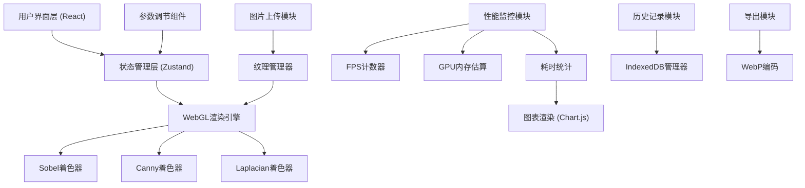
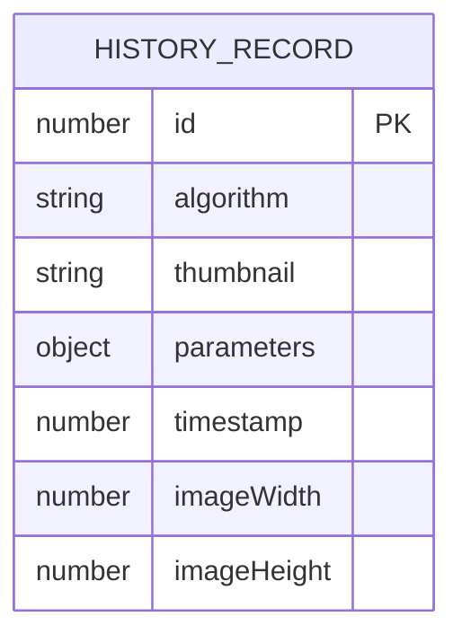

## 1. 架构设计



## 2. 技术描述

- **前端框架**：React@18 + TypeScript + Vite@5
- **样式方案**：TailwindCSS@3 + CSS变量主题系统
- **WebGL绑定**：原生 WebGL2 API（零依赖，性能最优）
- **状态管理**：Zustand（轻量级，适合高频参数更新）
- **图表库**：Chart.js@4（性能监控面板）
- **数据库**：IndexedDB 原生 API（历史记录缓存）
- **WebP编码**：浏览器原生 canvas.toDataURL('image/webp')

### 2.1 WebGL着色器架构

| 算法 | 顶点着色器 | 片段着色器 | 多Pass |
|------|-----------|-----------|--------|
| Sobel | 通用纹理采样 | 3x3卷积 + 梯度计算 | 否 |
| Canny | 通用纹理采样 | 高斯模糊 → 梯度计算 → 非极大值抑制 → 双阈值 | 是（4Pass） |
| Laplacian | 通用纹理采样 | 二阶导数卷积 + 零交叉检测 | 否 |

## 3. 路由定义

| 路由 | 用途 |
|-----|------|
| / | 主应用页面（单页应用，无多路由） |

## 4. 数据模型

### 4.1 IndexedDB 数据模型



### 4.2 参数数据结构

```typescript
interface EdgeDetectionParams {
  algorithm: 'sobel' | 'canny' | 'laplacian';
  kernelSize: 3 | 5 | 7;
  lowThreshold: number;    // 0-255
  highThreshold: number;   // 0-255, Canny专用
  intensity: number;       // 0.5-2.0
  grayscale: boolean;
}

interface HistoryRecord {
  id: number;
  algorithm: string;
  thumbnail: string;       // base64 缩略图
  parameters: EdgeDetectionParams;
  timestamp: number;
  imageWidth: number;
  imageHeight: number;
}

interface PerformanceMetrics {
  fps: number;
  gpuMemoryMB: number;
  processTime: {
    sobel: number;
    canny: number;
    laplacian: number;
  };
}
```

## 5. 核心模块设计

### 5.1 WebGL渲染模块
- **文件**：`src/webgl/WebGLRenderer.ts`
- **职责**：管理WebGL上下文、编译着色器、执行渲染管线
- **关键方法**：
  - `init(canvas: HTMLCanvasElement)` - 初始化上下文
  - `loadImage(image: HTMLImageElement)` - 加载纹理
  - `render(params: EdgeDetectionParams)` - 执行渲染
  - `readPixels()` - 读取渲染结果用于导出

### 5.2 着色器管理
- **文件**：`src/webgl/shaders/`
  - `vertex.glsl` - 通用顶点着色器
  - `sobel.frag` - Sobel算子片段着色器
  - `canny.frag` - Canny边缘检测片段着色器
  - `laplacian.frag` - Laplacian算子片段着色器
  - `blur.frag` - 高斯模糊（Canny预处理）

### 5.3 IndexedDB管理器
- **文件**：`src/utils/indexedDB.ts`
- **职责**：历史记录的增删改查
- **关键方法**：
  - `openDB()` - 打开数据库
  - `addRecord(record: Omit<HistoryRecord, 'id'>)` - 添加记录
  - `getRecords(limit?: number)` - 获取记录列表
  - `deleteRecord(id: number)` - 删除单条记录
  - `clearRecords()` - 清空所有记录

### 5.4 性能监控模块
- **文件**：`src/utils/performance.ts`
- **职责**：FPS计算、耗时统计、GPU内存估算
- **关键方法**：
  - `startFrame()` - 帧开始计时
  - `endFrame()` - 帧结束，更新FPS
  - `measureProcessTime(algorithm, fn)` - 测量算法耗时
  - `estimateGPUMemory(width, height)` - 估算纹理内存

## 6. 性能优化策略

1. **WebGL 双缓冲**：使用两个Framebuffer对象切换，避免读取渲染冲突
2. **参数防抖**：滑块参数变化使用requestAnimationFrame合并，避免高频渲染
3. **纹理复用**：图片纹理只上传一次，参数变化时复用已有纹理
4. **历史缩略图压缩**：缩略图使用256px宽度，WebP格式存储
5. **渲染暂停**：窗口失焦时暂停渲染循环，节省资源
