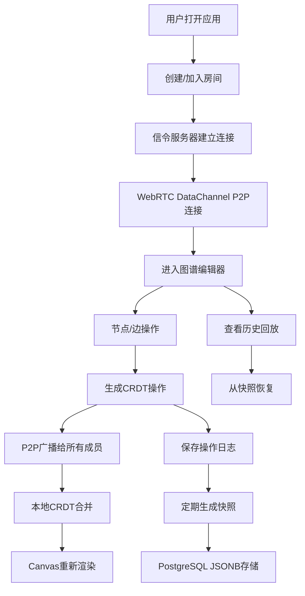

## 1. 产品概述

多人实时协作的知识图谱编辑器，支持团队成员同时编辑和查看知识图谱，通过P2P通信实现低延迟同步，CRDT数据结构解决并发冲突。

- 主要用途：团队知识管理、思维导图、概念图谱、领域知识建模
- 解决问题：传统单用户编辑器无法满足多人实时协作需求，中心化同步存在延迟和单点故障问题
- 目标用户：研究团队、产品经理、知识工作者、教育工作者
- 产品价值：提供低延迟、高可用的实时协作编辑体验，支持操作回放和版本追溯

## 2. 核心功能

### 2.1 用户角色
| 角色 | 注册方式 | 核心权限 |
|------|----------|----------|
| 协作编辑者 | 匿名加入/用户名登录 | 创建/加入房间、编辑图谱、查看历史、导出数据 |
| 房间管理员 | 创建房间后自动获得 | 管理房间成员、设置房间密码、导出/恢复快照 |

### 2.2 功能模块
1. **图谱编辑器页面**：Canvas画布、节点拖拽、连线、缩放、工具栏
2. **房间管理页面**：创建/加入房间、房间列表、成员管理
3. **历史回放页面**：操作日志列表、时间轴回放、快照恢复

### 2.3 页面详情
| 页面名称 | 模块名称 | 功能描述 |
|---------|----------|----------|
| 图谱编辑器 | Canvas画布 | 节点渲染、边渲染、缩略图、网格背景 |
| 图谱编辑器 | 节点操作 | 添加节点、删除节点、拖拽移动、编辑内容、修改样式 |
| 图谱编辑器 | 边操作 | 创建连线、删除连线、编辑标签、曲线调整 |
| 图谱编辑器 | 视图控制 | 缩放、平移、居中、全屏 |
| 图谱编辑器 | 协作状态 | 在线成员列表、光标位置、操作提示 |
| 房间管理 | 房间创建 | 生成房间ID、设置密码、配置选项 |
| 房间管理 | 房间加入 | 输入房间ID、密码验证、成员列表 |
| 历史回放 | 操作日志 | 操作列表、时间戳、操作人、操作类型 |
| 历史回放 | 快照管理 | 创建快照、快照列表、恢复快照、导出JSON |

## 3. 核心流程

用户打开应用 → 创建/加入房间 → 进入图谱编辑器 → 实时协作编辑（节点/边操作） → 操作通过WebRTC P2P同步 → CRDT自动解决冲突 → 定期保存快照到数据库 → 可随时查看历史回放或恢复快照

## 4. 用户界面设计

### 4.1 设计风格
- 设计方向：**科技未来感 + 极简实用**，采用深色主题配合霓虹点缀，突出知识图谱的视觉效果
- 主色调：深靛蓝 `#1e1b4b` 作为背景，电光紫 `#8b5cf6` 作为主色，青色 `#06b6d4` 作为辅助色
- 强调色：霓虹粉 `#ec4899` 用于高亮选中状态
- 按钮风格：圆角8px，轻微玻璃拟态效果，hover时有发光动效
- 字体：标题使用 `Space Grotesk`，正文使用 `Inter`，等宽字体使用 `JetBrains Mono`
- 布局：左侧工具栏 + 中央画布 + 右侧属性面板/成员列表，三栏式布局
- 图标：使用Lucide图标库，线条风格，24px标准尺寸

### 4.2 页面设计概述
| 页面名称 | 模块名称 | UI元素 |
|---------|----------|--------|
| 图谱编辑器 | Canvas画布 | 深色背景 + 网格点阵，节点用圆角矩形，边用贝塞尔曲线，选中时有发光描边 |
| 图谱编辑器 | 左侧工具栏 | 垂直排列工具按钮，选择模式、添加节点、添加连线、删除、缩放控制 |
| 图谱编辑器 | 右侧面板 | Tab切换：属性编辑、成员列表、操作历史 |
| 图谱编辑器 | 顶部导航 | 房间名称、在线人数、保存状态、导出按钮、全屏按钮 |
| 房间管理 | 主界面 | 卡片式房间列表，悬浮动效，渐变背景卡片 |
| 房间管理 | 创建表单 | 玻璃拟态模态框，输入框带发光边框，按钮有脉冲动画 |
| 历史回放 | 时间轴 | 底部水平时间轴，可拖拽滑块，节点标记关键操作 |
| 历史回放 | 操作列表 | 左侧列表，每项有操作图标、时间、用户、操作描述 |

### 4.3 响应性
- 桌面端（≥1280px）：三栏完整布局，画布区域占60%以上
- 平板端（768px-1279px）：右侧面板可折叠为抽屉，工具栏改为水平顶部排列
- 移动端（<768px）：简化视图，工具栏折叠为浮动按钮组，面板全屏弹出
- 触摸优化：支持双指缩放、单指拖拽、长按选中

### 4.4 动效设计
- 页面加载：画布淡入，工具栏从两侧滑入，节点逐个出现的渐入动画
- 节点操作：选中时有缩放+发光动画，拖拽时有半透明跟随效果
- 连线创建：从起点到终点的绘制轨迹动画，完成时的弹性效果
- 协作提示：远程用户光标有颜色区分的拖尾效果，操作时的涟漪提示
- 状态变化：保存成功的勾选动画，连接断开的警告闪烁
