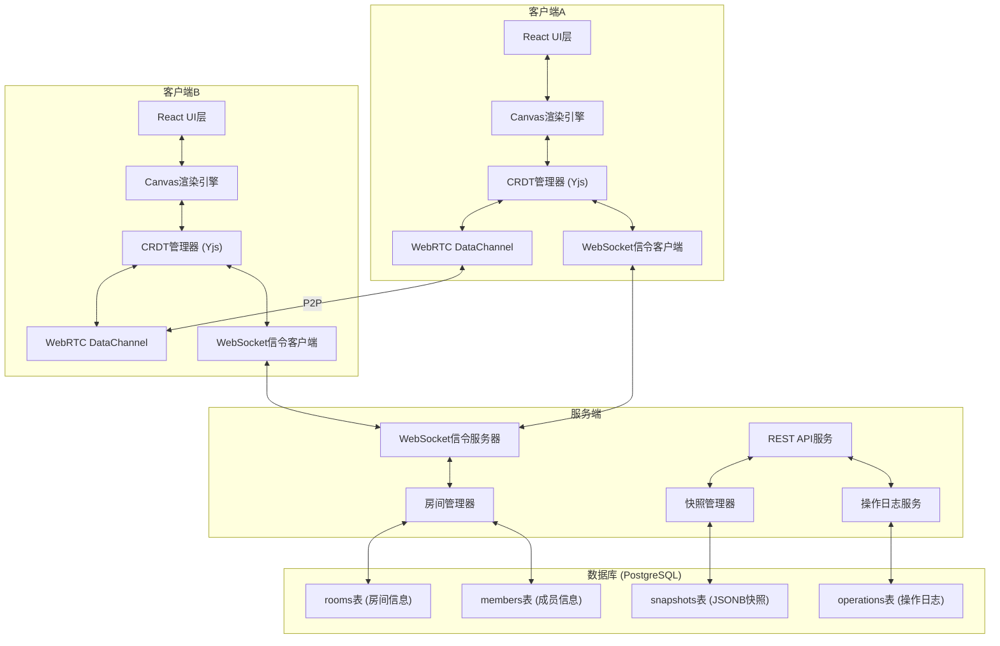
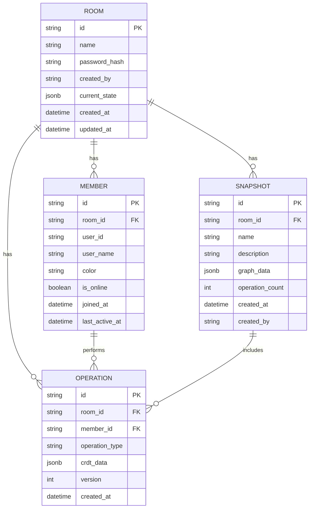
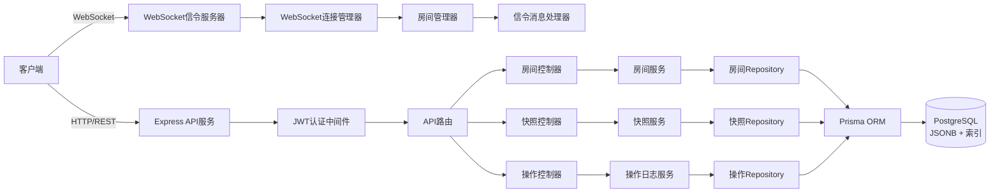

## 1. 架构设计



## 2. 技术描述

### 2.1 前端技术栈
- **框架**: React 18.2.0 + TypeScript 5.3
- **构建工具**: Vite 5.0
- **样式**: TailwindCSS 3.4 + 自定义CSS变量
- **路由**: React Router DOM 6.20
- **状态管理**: Zustand 4.4 (轻量状态管理)
- **CRDT**: Yjs 13.6 (成熟的CRDT实现，支持自动冲突合并)
- **WebRTC**: simple-peer 9.11 (封装WebRTC DataChannel)
- **WebSocket**: reconnecting-websocket 4.0 (自动重连WebSocket)
- **Canvas渲染**: 原生Canvas 2D API + 自定义渲染引擎
- **图标**: Lucide React 0.294
- **日期处理**: dayjs 1.11

### 2.2 后端技术栈
- **运行时**: Node.js 20 + TypeScript 5.3
- **Web框架**: Express 4.18
- **WebSocket**: ws 8.14
- **WebRTC信令**: 自定义信令协议
- **数据库**: PostgreSQL 15 + JSONB
- **ORM**: Prisma 5.7 (类型安全的数据库访问)
- **认证**: JSON Web Token (jsonwebtoken 9.0)
- **环境变量**: dotenv 16.3
- **CORS**: cors 2.8

### 2.3 核心技术选型理由
1. **Yjs CRDT**: 成熟稳定的CRDT实现，支持自动冲突解决，社区活跃，文档完善
2. **WebRTC DataChannel**: 低延迟P2P通信，减少服务器带宽压力，支持离线协作
3. **PostgreSQL JSONB**: 高效存储和查询图谱快照数据，支持JSON索引
4. **Canvas 2D**: 高性能渲染大量节点和边，比SVG更适合实时交互场景
5. **Prisma**: 类型安全，迁移管理方便，支持PostgreSQL高级特性

## 3. 目录结构

### 3.1 前端目录 (client/)
```
client/
├── src/
│   ├── components/          # React组件
│   │   ├── editor/         # 编辑器组件
│   │   │   ├── Canvas.tsx
│   │   │   ├── Toolbar.tsx
│   │   │   ├── PropertyPanel.tsx
│   │   │   └── MemberList.tsx
│   │   ├── room/           # 房间管理组件
│   │   └── history/        # 历史回放组件
│   ├── hooks/              # 自定义Hooks
│   │   ├── useCanvas.ts
│   │   ├── useCRDT.ts
│   │   ├── useWebRTC.ts
│   │   └── useWebSocket.ts
│   ├── store/              # Zustand状态管理
│   │   ├── editorStore.ts
│   │   ├── roomStore.ts
│   │   └── userStore.ts
│   ├── crdt/               # CRDT相关
│   │   ├── YjsProvider.ts
│   │   └── operations.ts
│   ├── webrtc/             # WebRTC相关
│   │   ├── PeerManager.ts
│   │   └── SignalingClient.ts
│   ├── canvas/             # Canvas渲染引擎
│   │   ├── Renderer.ts
│   │   ├── Node.ts
│   │   ├── Edge.ts
│   │   └── Viewport.ts
│   ├── types/              # TypeScript类型定义
│   │   ├── graph.ts
│   │   ├── crdt.ts
│   │   └── api.ts
│   ├── utils/              # 工具函数
│   ├── api/                # API客户端
│   ├── pages/              # 页面组件
│   ├── App.tsx
│   └── main.tsx
├── package.json
├── vite.config.ts
└── tailwind.config.js
```

### 3.2 后端目录 (server/)
```
server/
├── src/
│   ├── controllers/        # 控制器层
│   │   ├── roomController.ts
│   │   ├── snapshotController.ts
│   │   └── operationController.ts
│   ├── services/           # 业务逻辑层
│   │   ├── roomService.ts
│   │   ├── snapshotService.ts
│   │   └── operationService.ts
│   ├── repositories/       # 数据访问层
│   │   ├── roomRepository.ts
│   │   ├── snapshotRepository.ts
│   │   └── operationRepository.ts
│   ├── signaling/          # 信令服务器
│   │   ├── SignalingServer.ts
│   │   └── WebSocketManager.ts
│   ├── middleware/         # Express中间件
│   ├── prisma/             # Prisma配置
│   │   ├── schema.prisma
│   │   └── migrations/
│   ├── types/              # 类型定义
│   ├── utils/              # 工具函数
│   ├── config/             # 配置
│   ├── app.ts
│   └── server.ts
├── package.json
└── tsconfig.json
```

## 4. 路由定义

| 路由 | 页面 | 功能描述 |
|------|------|----------|
| `/` | 首页 | 应用介绍、创建/加入房间入口 |
| `/rooms` | 房间列表 | 显示可用房间、创建新房间 |
| `/room/:roomId` | 图谱编辑器 | 主要编辑页面，Canvas画布 |
| `/room/:roomId/history` | 历史回放 | 操作日志和快照管理 |

## 5. API定义

### 5.1 房间管理API
```typescript
// 创建房间
POST /api/rooms
Request: { name: string, password?: string, userId: string, userName: string }
Response: { roomId: string, token: string, room: Room }

// 加入房间
POST /api/rooms/:roomId/join
Request: { userId: string, userName: string, password?: string }
Response: { token: string, room: Room, members: Member[] }

// 获取房间信息
GET /api/rooms/:roomId
Response: { room: Room, members: Member[] }

// 房间列表
GET /api/rooms
Response: { rooms: Room[] }
```

### 5.2 快照API
```typescript
// 创建快照
POST /api/rooms/:roomId/snapshots
Request: { name: string, description?: string }
Response: { snapshotId: string, snapshot: Snapshot }

// 快照列表
GET /api/rooms/:roomId/snapshots
Response: { snapshots: Snapshot[] }

// 获取快照详情
GET /api/snapshots/:snapshotId
Response: { snapshot: Snapshot, data: GraphData }

// 恢复快照
POST /api/snapshots/:snapshotId/restore
Response: { success: true, newSnapshotId: string }

// 导出快照
GET /api/snapshots/:snapshotId/export
Response: JSON文件下载
```

### 5.3 操作日志API
```typescript
// 操作日志列表
GET /api/rooms/:roomId/operations
Query: { from?: timestamp, to?: timestamp, limit?: number, offset?: number }
Response: { operations: Operation[], total: number }

// 回放操作
POST /api/rooms/:roomId/replay
Request: { fromOperationId?: string, toOperationId?: string, fromTime?: timestamp, toTime?: timestamp }
Response: { frames: ReplayFrame[] }

// 保存操作
POST /api/rooms/:roomId/operations
Request: { operation: CRDTOperation }
Response: { operationId: string }
```

## 6. 数据模型

### 6.1 实体关系图


### 6.2 Prisma Schema (DDL)
```prisma
model Room {
  id            String     @id @default(uuid())
  name          String
  passwordHash  String?
  createdBy     String
  currentState  Json       @default("{}")
  createdAt     DateTime   @default(now())
  updatedAt     DateTime   @updatedAt
  snapshots     Snapshot[]
  operations    Operation[]
  members       Member[]
}

model Snapshot {
  id              String   @id @default(uuid())
  roomId          String
  room            Room     @relation(fields: [roomId], references: [id])
  name            String
  description     String?
  graphData       Json
  operationCount  Int      @default(0)
  createdAt       DateTime @default(now())
  createdBy       String
  operations      Operation[]
}

model Operation {
  id            String   @id @default(uuid())
  roomId        String
  room          Room     @relation(fields: [roomId], references: [id])
  memberId      String
  member        Member   @relation(fields: [memberId], references: [id])
  operationType String
  crdtData      Json
  version       Int
  createdAt     DateTime @default(now())
  snapshotId    String?
  snapshot      Snapshot? @relation(fields: [snapshotId], references: [id])
  @@index([roomId, createdAt])
}

model Member {
  id            String      @id @default(uuid())
  roomId        String
  room          Room        @relation(fields: [roomId], references: [id])
  userId        String
  userName      String
  color         String
  isOnline      Boolean     @default(true)
  joinedAt      DateTime    @default(now())
  lastActiveAt  DateTime    @default(now())
  operations    Operation[]
  @@unique([roomId, userId])
}
```

### 6.3 核心数据结构
```typescript
// 图谱节点
interface GraphNode {
  id: string;
  x: number;
  y: number;
  width: number;
  height: number;
  label: string;
  color: string;
  type: 'concept' | 'topic' | 'note' | 'resource';
  metadata: Record<string, any>;
  createdAt: number;
  updatedAt: number;
}

// 图谱边
interface GraphEdge {
  id: string;
  source: string;
  target: string;
  label?: string;
  color?: string;
  style: 'solid' | 'dashed' | 'dotted';
  metadata: Record<string, any>;
  createdAt: number;
  updatedAt: number;
}

// 图谱数据
interface GraphData {
  nodes: Record<string, GraphNode>;
  edges: Record<string, GraphEdge>;
  metadata: {
    version: number;
    lastModified: number;
    modifiedBy: string;
  };
}

// CRDT操作类型
type CRDTOperationType = 
  | 'node/add'
  | 'node/update'
  | 'node/delete'
  | 'edge/add'
  | 'edge/update'
  | 'edge/delete'
  | 'graph/metadata';

// CRDT操作
interface CRDTOperation {
  id: string;
  type: CRDTOperationType;
  roomId: string;
  memberId: string;
  timestamp: number;
  version: number;
  payload: any;
  yjsUpdate: Uint8Array; // Yjs编码的更新
}

// 信令消息类型
type SignalingMessageType =
  | 'join'
  | 'leave'
  | 'offer'
  | 'answer'
  | 'ice-candidate'
  | 'member-joined'
  | 'member-left'
  | 'sync-state';

// 信令消息
interface SignalingMessage {
  type: SignalingMessageType;
  from: string;
  to?: string;
  roomId: string;
  payload: any;
  timestamp: number;
}
```

## 7. 服务端架构图



## 8. 核心算法与协议

### 8.1 CRDT同步机制
1. 每个客户端维护一个Yjs Doc实例，包含nodes和edges两个Y.Map
2. 本地操作触发Yjs更新事件，编码为Uint8Array
3. 通过WebRTC DataChannel广播给所有对等节点
4. 接收方应用Yjs更新，自动解决冲突（基于逻辑时钟和 Lamport 时间戳）
5. 定期（每100次操作或1分钟）将全量状态保存为快照

### 8.2 WebRTC连接建立流程
```
客户端A                        信令服务器                        客户端B
    |  join(roomId)           |                                 |
    |------------------------>|                                 |
    |                         |  member-joined(A)               |
    |                         |-------------------------------->|
    |                         |  member-list([B])                |
    |<----------------------------------------|                 |
    |  offer(to=B)            |                                 |
    |------------------------>|  offer(from=A)                   |
    |                         |-------------------------------->|
    |                         |  answer(from=B)                  |
    |<----------------------------------------|                 |
    |  ice-candidate          |                                 |
    |<------->|  ice-candidate |                                 |
    |                         |-------------------------------->|
    |<---------------------->| P2P DataChannel 建立              |
    |        直接通信          |                                 |
```

### 8.3 Canvas渲染优化
1. **视口裁剪**: 只渲染当前可见区域内的节点和边
2. **分层渲染**: 背景层 → 边层 → 节点层 → 选中层 → UI层
3. **脏矩形**: 只重绘变化的区域
4. **离屏Canvas**: 复杂图形预渲染到离屏Canvas
5. **requestAnimationFrame**: 与浏览器刷新同步，避免卡顿

### 8.4 冲突解决策略
使用Yjs的CRDT算法，基于以下原则：
- **因果一致性**: 操作按因果顺序应用
- **并发操作**: 最后写入者获胜（基于逻辑时钟）
- **删除操作**: 使用墓碑标记，避免复活问题
- **移动冲突**: 保留最新的位置，旧位置被覆盖
