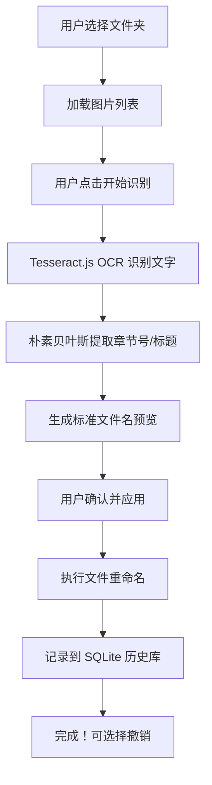

## 1. 产品概述

漫画图片批量重命名工具，帮助用户自动识别杂乱命名的漫画图片中的章节号和标题，通过 OCR 和 NLP 技术将文件名标准化，提高漫画收藏管理效率。

- 解决用户手动重命名大量漫画图片的繁琐问题
- 目标用户：漫画收藏爱好者、扫描版漫画整理者
- 产品价值：自动化、智能化的文件重命名解决方案

## 2. 核心功能

### 2.1 功能模块

1. **主界面**：文件夹选择、图片列表展示、操作控制区
2. **OCR 识别模块**：调用 Tesseract.js 本地识别图片文字
3. **NLP 标准化模块**：使用朴素贝叶斯分类器提取并标准化文件名
4. **预览面板**：修改前后文件名对比、图片预览
5. **历史记录模块**：SQLite 存储重命名历史、支持批量撤销

### 2.2 页面详情

| 页面名称 | 模块名称 | 功能描述 |
|---------|---------|---------|
| 主界面 | 文件夹选择区 | 选择本地漫画图片文件夹、显示图片统计信息 |
| 主界面 | 图片列表区 | 展示所有图片、缩略图预览、原始文件名 |
| 主界面 | 操作控制区 | 开始识别、应用重命名、撤销操作按钮 |
| 主界面 | 预览对比区 | 左右分栏显示修改前后文件名、图片预览 |
| 主界面 | 历史记录区 | 显示重命名历史记录、支持批量选择撤销 |

## 3. 核心流程

## 4. 用户界面设计

### 4.1 设计风格

- **主色调**：深紫色 (#6366F1) 作为主色，代表创意与智能
- **辅助色**：青色 (#06B6D4) 用于强调操作按钮
- **背景**：深色主题 (#1E1E2E)，符合夜间使用场景
- **按钮风格**：圆角渐变按钮，带有微悬浮动效
- **字体**：使用 JetBrains Mono 等宽字体展示文件名，配合现代无衬线字体
- **布局风格**：三栏式布局（左侧列表、中间预览、右侧操作）
- **图标风格**：线性图标，简洁现代

### 4.2 页面设计概述

| 页面名称 | 模块名称 | UI 元素 |
|---------|---------|---------|
| 主界面 | 文件夹选择区 | 拖拽区域、文件夹图标、路径显示 |
| 主界面 | 图片列表区 | 网格/列表切换、缩略图、文件名、状态标签 |
| 主界面 | 预览对比区 | 左右分栏、箭头动画、高亮差异文字 |
| 主界面 | 操作控制区 | 进度条、操作按钮组、状态提示 |
| 主界面 | 历史记录区 | 时间线样式、可折叠、批量选择复选框 |

### 4.3 响应式

- 桌面端优先设计，支持窗口大小调整
- 最小窗口尺寸：1200x700px
- 面板可拖拽调整宽度
- 支持全屏模式

## 5. 非功能需求

- **离线运行**：所有功能本地运行，无需网络连接
- **性能**：处理 100 张图片时间 ≤ 2 分钟
- **准确率**：OCR 识别准确率 ≥ 85%，文件名标准化准确率 ≥ 90%
- **安全性**：仅读取和重命名用户选择的文件夹，不访问其他文件
