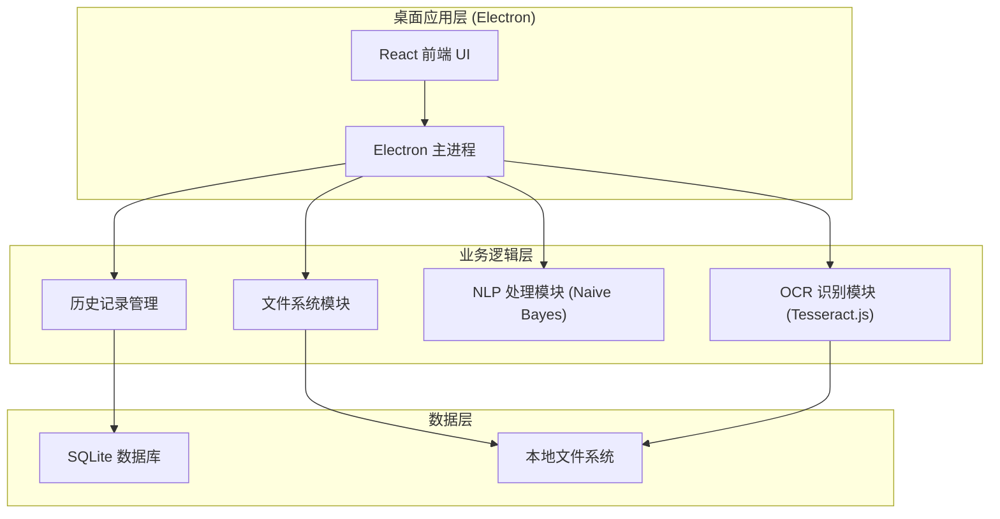
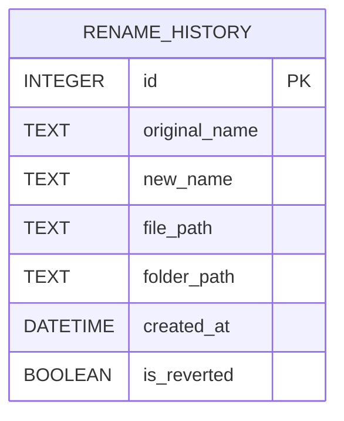

## 1. 架构设计



## 2. 技术描述

- **前端框架**：React@18 + TypeScript + Vite
- **桌面框架**：Electron@28 + electron-builder
- **样式方案**：TailwindCSS@3
- **OCR 引擎**：Tesseract.js (本地运行，中文语言包)
- **NLP 算法**：自定义朴素贝叶斯分类器 (用于识别章节号和标题)
- **数据库**：better-sqlite3 (本地 SQLite 数据库)
- **状态管理**： Zustand

## 3. 项目结构

```
src/
├── main/                 # Electron 主进程
│   ├── index.ts         # 主进程入口
│   ├── ocr.ts           # OCR 识别逻辑
│   ├── nlp.ts           # 朴素贝叶斯 NLP 处理
│   ├── database.ts      # SQLite 数据库操作
│   └── fileManager.ts   # 文件系统操作
├── renderer/            # React 渲染进程
│   ├── App.tsx
│   ├── components/
│   │   ├── FolderSelector.tsx
│   │   ├── ImageList.tsx
│   │   ├── PreviewPanel.tsx
│   │   ├── HistoryPanel.tsx
│   │   └── ProgressBar.tsx
│   ├── store/
│   │   └── useAppStore.ts
│   └── types/
│       └── index.ts
└── shared/              # 共享类型
    └── types.ts
```

## 4. 数据模型

### 4.1 数据模型定义



### 4.2 DDL 语句

```sql
CREATE TABLE IF NOT EXISTS rename_history (
    id INTEGER PRIMARY KEY AUTOINCREMENT,
    original_name TEXT NOT NULL,
    new_name TEXT NOT NULL,
    file_path TEXT NOT NULL,
    folder_path TEXT NOT NULL,
    created_at DATETIME DEFAULT CURRENT_TIMESTAMP,
    is_reverted BOOLEAN DEFAULT 0
);

CREATE INDEX IF NOT EXISTS idx_folder_path ON rename_history(folder_path);
CREATE INDEX IF NOT EXISTS idx_created_at ON rename_history(created_at);
```

## 5. 核心模块说明

### 5.1 OCR 模块 (Tesseract.js)

- 使用 Tesseract.js 的 chi_sim+eng 语言包
- 优先识别图片顶部 1/3 区域（标题通常在顶部）
- 支持批量处理，带进度回调

### 5.2 NLP 模块 (Naive Bayes)

- 训练数据：常见漫画标题模式、章节号格式
- 特征提取：关键词匹配、正则表达式模式
- 分类器输出：系列名、章节号、标题
- 支持用户自定义规则模板

### 5.3 文件管理模块

- 安全的文件重命名（先检查目标文件是否存在）
- 支持批量操作
- 自动处理重名冲突（添加序号后缀）

### 5.4 历史记录模块

- 每次重命名操作记录到 SQLite
- 按操作时间分组显示
- 支持单条和批量撤销
- 自动清理 30 天以上的历史记录

## 6. 主进程 IPC 通信

| 通道名称 | 方向 | 参数 | 返回值 |
|---------|------|------|--------|
| folder:select | Renderer → Main | - | 文件夹路径 |
| folder:scan | Renderer → Main | folderPath | 图片文件列表 |
| ocr:recognize | Renderer → Main | filePaths | OCR 识别结果 |
| rename:apply | Renderer → Main | renameItems[] | 操作结果 |
| rename:revert | Renderer → Main | historyIds[] | 操作结果 |
| history:get | Renderer → Main | folderPath, limit | 历史记录列表 |
