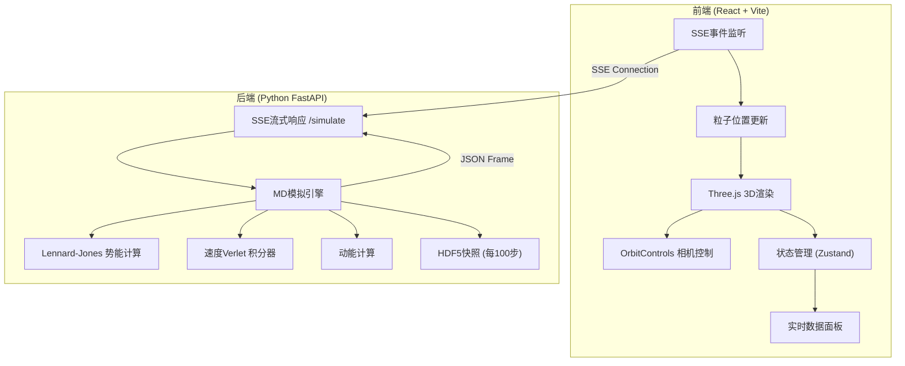

## 1. 架构设计



## 2. 技术描述

- **前端**：React@18 + TypeScript + Vite + TailwindCSS@3 + Three.js + @react-three/fiber + @react-three/drei + @react-three/postprocessing + Zustand
- **后端**：Python 3.9+ + FastAPI + Uvicorn + NumPy + h5py
- **通信协议**：Server-Sent Events (SSE)
- **数据格式**：JSON（每帧粒子位置），HDF5（轨迹快照）
- **状态管理**：Zustand

## 3. 目录结构

```
k64/
├── .trae/documents/          # 文档目录
├── frontend/                 # React前端
│   ├── src/
│   │   ├── components/       # 组件
│   │   │   ├── ParticleScene.tsx    # 3D粒子场景
│   │   │   └── InfoPanel.tsx        # 信息面板
│   │   ├── hooks/            # 自定义hooks
│   │   │   └── useSimulation.ts     # SSE连接hook
│   │   ├── store/            # 状态管理
│   │   │   └── useSimulationStore.ts
│   │   ├── App.tsx           # 主应用
│   │   └── main.tsx          # 入口
│   └── package.json
├── backend/                  # Python后端
│   ├── main.py               # FastAPI入口
│   ├── simulation/           # 模拟引擎
│   │   ├── __init__.py
│   │   ├── lj_simulator.py   # Lennard-Jones模拟器
│   │   └── hdf5_writer.py    # HDF5写入器
│   └── requirements.txt      # Python依赖
└── data/                     # HDF5输出目录
```

## 4. 前端路由定义

| 路由 | 用途 |
|------|------|
| / | 主页面 - 3D粒子模拟可视化 |

## 5. API 定义

### 5.1 SSE 流式端点

**GET /simulate**

启动Lennard-Jones模拟并通过SSE流式推送每帧数据。

**响应格式**（每条event）：
```typescript
interface SimulationFrame {
  step: number;
  time: number;
  kinetic_energy: number;
  potential_energy: number;
  total_energy: number;
  positions: number[][];  // [1000][3] - x, y, z坐标
  snapshot_saved: boolean;
}
```

**SSE事件格式**：
```
data: {"step": 0, "time": 0.0, "kinetic_energy": 1.5, ...}
```

### 5.2 静态资源端点

**GET /** - 提供前端静态文件

**GET /{filename}** - 提供前端资源

## 6. 后端核心数据结构

### 6.1 Lennard-Jones 模拟参数

```python
@dataclass
class SimulationParams:
    n_particles: int = 1000          # 粒子数量
    box_size: float = 10.0           # 模拟盒子大小
    temperature: float = 1.0         # 初始温度
    epsilon: float = 1.0             # LJ势能深度
    sigma: float = 1.0               # LJ粒子直径
    dt: float = 0.001                # 时间步长
    r_cut: float = 2.5               # 截断半径
    snapshot_interval: int = 100     # 快照保存间隔
```

### 6.2 HDF5 数据结构

```
trajectory.h5
├── parameters/                  # 模拟参数组
│   ├── n_particles
│   ├── box_size
│   ├── epsilon
│   ├── sigma
│   └── dt
└── trajectory/                  # 轨迹数据组
    ├── step (N,)                # 步数组
    ├── time (N,)                # 时间数组
    ├── kinetic_energy (N,)      # 动能数组
    ├── potential_energy (N,)    # 势能数组
    └── positions (N, 1000, 3)   # 位置数组
```

## 7. 物理算法

### 7.1 Lennard-Jones 势能
$$ V(r) = 4\epsilon \left[ \left(\frac{\sigma}{r}\right)^{12} - \left(\frac{\sigma}{r}\right)^6 \right] $$

### 7.2 速度Verlet积分
$$ r(t+dt) = r(t) + v(t)dt + \frac{1}{2}a(t)dt^2 $$
$$ v(t+dt) = v(t) + \frac{1}{2}[a(t) + a(t+dt)]dt $$

## 8. 性能优化

- **NumPy向量化**：所有粒子计算使用NumPy数组操作
- **邻居列表**：优化LJ力计算，减少O(N²)复杂度
- **BufferGeometry**：Three.js使用BufferGeometry高效渲染1000个粒子
- **SSE连接复用**：单连接持续推送数据，避免重复握手
