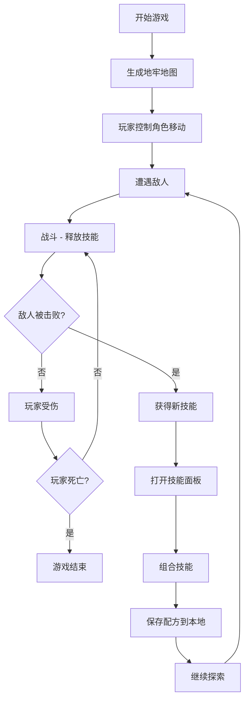

## 1. 产品概述
一款基于ECS架构的地牢探险游戏，玩家控制角色在地牢中移动并击败敌人，通过收集和组合技能来增强战斗力。

- 核心玩法：地牢探索 + 技能收集与组合 + 实时战斗
- 目标用户：喜欢Roguelike和动作游戏的玩家
- 产品价值：提供富有策略性的技能组合玩法，每次游戏体验都有独特性

## 2. 核心功能

### 2.1 功能模块
1. **游戏主界面**：地牢地图渲染、角色控制、实时战斗
2. **技能系统**：基础技能获取、技能组合配方、技能效果释放
3. **存档系统**：本地保存技能组合配方、游戏进度
4. **UI界面**：生命值显示、技能栏、伤害浮动文字、技能组合提示

### 2.2 页面详情
| 页面名称 | 模块名称 | 功能描述 |
|---------|---------|---------|
| 游戏主界面 | 地牢地图 | 随机生成地牢房间，墙壁和地面渲染 |
| 游戏主界面 | 角色控制 | WASD/方向键移动，鼠标点击释放技能 |
| 游戏主界面 | 战斗系统 | 敌人AI巡逻、攻击判定、伤害计算 |
| 技能面板 | 技能展示 | 显示已获得技能、可组合技能预览 |
| 技能面板 | 组合系统 | 拖拽两个技能进行组合，生成新技能 |
| 存档界面 | 存档管理 | 保存/读取技能配方、显示已解锁配方 |

## 3. 核心流程

玩家进入游戏 → 控制角色在地牢中移动 → 遭遇敌人并战斗 → 击败敌人获得技能 → 打开技能面板组合技能 → 使用组合技能击败更强敌人 → 解锁新配方并保存 → 继续深入地牢

## 4. 用户界面设计

### 4.1 设计风格
- **主色调**：深紫色 (#1a0a2e) 作为地牢背景，橙色 (#ff6b35) 作为火焰技能，蓝色 (#4ecdc4) 作为冰霜技能
- **辅助色**：金色 (#ffd93d) 作为组合技能特效，红色 (#ff4757) 作为伤害提示
- **按钮风格**：圆角矩形，带有发光边框和悬浮动画
- **字体**：使用像素风格字体 "Press Start 2P" 作为标题，"VT323" 作为正文
- **布局风格**：游戏画布居中，UI元素环绕四周，技能栏在底部
- **视觉效果**：像素艺术风格，带有 CRT 扫描线效果和屏幕抖动

### 4.2 页面设计概述
| 页面名称 | 模块名称 | UI元素 |
|---------|---------|--------|
| 游戏主界面 | 地牢渲染 | 像素瓷砖地图、动态光照、迷雾效果 |
| 游戏主界面 | 角色渲染 | 玩家精灵、朝向动画、移动轨迹 |
| 游戏主界面 | 敌人渲染 | 不同类型敌人精灵、AI状态指示 |
| 游戏主界面 | 技能特效 | 火球飞行轨迹、冰箭粒子效果、爆炸动画 |
| 技能面板 | 技能卡片 | 技能图标、名称、描述、稀有度边框 |
| 技能面板 | 组合区域 | 拖拽槽、组合预览、确认按钮 |
| HUD界面 | 状态显示 | 生命值条、魔力值条、当前层数 |
| HUD界面 | 伤害文字 | 浮动数字、暴击特效、颜色区分 |

### 4.3 响应式
- 桌面端：1280x720 游戏画布，固定UI布局
- 移动端：自适应缩放画布，虚拟摇杆控制
- 支持全屏模式切换

## 5. 游戏元素定义

### 5.1 基础技能
| 技能名称 | 类型 | 伤害 | 效果 |
|---------|------|------|------|
| 火球 | 火焰 | 25 | 造成范围伤害，有燃烧效果 |
| 冰箭 | 冰霜 | 20 | 减速敌人，有冰冻几率 |
| 雷击 | 雷电 | 30 | 连锁伤害，可跳跃至附近敌人 |
| 风刃 | 风暴 | 15 | 穿透多个敌人 |

### 5.2 组合技能配方
| 技能A | 技能B | 组合结果 | 效果 |
|-------|-------|---------|------|
| 火球 | 冰箭 | 爆炸箭 | 造成大范围爆炸，同时燃烧和减速 |
| 火球 | 雷击 | 等离子球 | 高伤害电火混合伤害，麻痹效果 |
| 冰箭 | 风刃 | 暴风雪 | 持续范围伤害，大幅减速 |
| 雷击 | 风刃 | 雷暴 | 召唤雷电风暴，多目标打击 |
