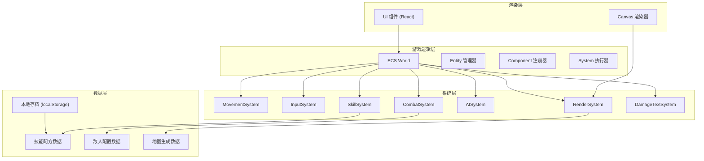

## 1. 架构设计



## 2. 技术描述

- **前端框架**: React@18 + TypeScript
- **构建工具**: Vite@5
- **样式方案**: TailwindCSS@3
- **状态管理**: Zustand
- **游戏渲染**: HTML5 Canvas 2D
- **图标库**: Lucide React
- **数据持久化**: localStorage API

## 3. 核心架构 - ECS 模式

### 3.1 ECS 核心概念
- **Entity (实体)**: 仅包含唯一ID的空对象，玩家、敌人、技能弹、特效都是实体
- **Component (组件)**: 纯数据结构，不包含逻辑 (Position, Velocity, Health, Skill, Renderable 等)
- **System (系统)**: 处理具有特定组件组合的实体，实现游戏逻辑

### 3.2 组件定义
```typescript
interface Position { x: number; y: number }
interface Velocity { vx: number; vy: number; speed: number }
interface Health { current: number; max: number }
interface InputControlled { keys: Set<string> }
interface Enemy { type: 'slime' | 'skeleton' | 'ghost'; aiState: string }
interface Skill { skillId: string; damage: number; cooldown: number }
interface Projectile { skillId: string; damage: number; lifetime: number }
interface Renderable { sprite: string; color: string; size: number }
interface DamageText { text: string; color: string; lifetime: number }
```

### 3.3 系统定义
| 系统名称 | 处理组件 | 功能描述 |
|---------|---------|---------|
| InputSystem | InputControlled, Velocity | 处理键盘输入，更新移动速度 |
| MovementSystem | Position, Velocity | 根据速度更新位置，处理碰撞 |
| AISystem | Enemy, Position, Velocity | 敌人AI逻辑，追踪玩家 |
| CombatSystem | Health, Position | 处理碰撞检测和伤害计算 |
| SkillSystem | Skill, Projectile | 技能释放、技能组合、弹丸生成 |
| DamageTextSystem | DamageText, Position | 浮动伤害文字的生命周期管理 |
| RenderSystem | Position, Renderable | Canvas 渲染所有可见实体 |

## 4. 技能组合系统

### 4.1 数据结构
```typescript
interface SkillRecipe {
  id: string;
  ingredients: [string, string];
  result: string;
  discovered: boolean;
}

interface Skill {
  id: string;
  name: string;
  type: 'fire' | 'ice' | 'lightning' | 'wind' | 'combined';
  damage: number;
  effect: SkillEffect;
  color: string;
  icon: string;
}
```

### 4.2 组合逻辑
- 玩家击败敌人有几率掉落基础技能
- 在技能面板中拖拽两个技能到组合槽
- 系统检查是否存在匹配的配方
- 如果配方存在且未解锁，解锁并保存到本地
- 组合后的技能可以装备使用

## 5. 本地存档系统

### 5.1 存储结构
```typescript
interface GameSave {
  discoveredRecipes: string[];
  unlockedSkills: string[];
  highScore: number;
  deepestFloor: number;
  playTime: number;
}
```

### 5.2 存储键
- `dungeon_skill_recipes`: 已发现的技能配方
- `dungeon_player_skills`: 玩家已解锁的技能
- `dungeon_game_stats`: 游戏统计数据

## 6. 目录结构

```
src/
├── game/
│   ├── ecs/
│   │   ├── Entity.ts          # 实体类
│   │   ├── Component.ts       # 组件定义
│   │   ├── System.ts          # 系统基类
│   │   └── World.ts           # ECS 世界
│   ├── systems/
│   │   ├── InputSystem.ts
│   │   ├── MovementSystem.ts
│   │   ├── AISystem.ts
│   │   ├── CombatSystem.ts
│   │   ├── SkillSystem.ts
│   │   ├── DamageTextSystem.ts
│   │   └── RenderSystem.ts
│   ├── components/
│   │   ├── Position.ts
│   │   ├── Velocity.ts
│   │   ├── Health.ts
│   │   ├── Skill.ts
│   │   └── Renderable.ts
│   ├── data/
│   │   ├── skills.ts          # 技能数据
│   │   ├── recipes.ts         # 配方数据
│   │   └── enemies.ts         # 敌人数据
│   ├── map/
│   │   └── DungeonGenerator.ts
│   └── utils/
│       ├── storage.ts         # 本地存储
│       └── collision.ts
├── components/
│   ├── GameCanvas.tsx
│   ├── SkillPanel.tsx
│   ├── HUD.tsx
│   ├── RecipeBook.tsx
│   └── DamageTextLayer.tsx
├── hooks/
│   └── useGameLoop.ts
├── store/
│   └── useGameStore.ts
├── pages/
│   └── GamePage.tsx
├── App.tsx
└── main.tsx
```

## 7. 游戏循环

```typescript
// 固定时间步长的游戏循环
function gameLoop(timestamp: number) {
  const deltaTime = timestamp - lastTime;
  
  // 输入处理
  inputSystem.update(deltaTime);
  
  // AI 更新
  aiSystem.update(deltaTime);
  
  // 物理/移动更新
  movementSystem.update(deltaTime);
  
  // 技能更新
  skillSystem.update(deltaTime);
  
  // 战斗/碰撞检测
  combatSystem.update(deltaTime);
  
  // 伤害文字更新
  damageTextSystem.update(deltaTime);
  
  // 渲染
  renderSystem.update(deltaTime);
  
  lastTime = timestamp;
  requestAnimationFrame(gameLoop);
}
```
